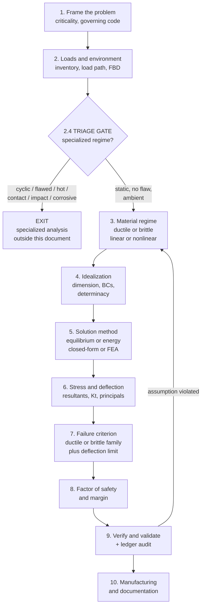

# Universal Mechanical Design & Stress Analysis Checklist

A navigable decision tree for the **common case**: static loading, linear-elastic response, strength and deflection limit states, ductile or brittle metals.

Specialized regimes — fatigue, fracture, creep, contact, impact, corrosion, shell buckling — are **detected and routed out** at [§2.4](#24-triage-gate-does-a-specialized-regime-govern), not developed here. That is deliberate. A checklist that tries to cover everything covers nothing well; this one covers the 80% case densely and tells you honestly when you have left it.

---

## 0. How to use this document

### 0.1 Node types

Every numbered node carries a type badge. **The distinction between FORK and ALL matters** — mistaking an AND-node for an either/or is how whole load cases get dropped.

| Badge | Meaning |
|---|---|
| **FORK** | Either/or. Pick one path. The comparison table tells you which. |
| **ALL** | Every item applies. This is a completeness check, not a choice. |
| **GATE** | Routing. Answer the screening questions; each yes sends you somewhere. |
| **EXIT** | Leaves this document. The specialized analysis happens elsewhere. |

### 0.2 The Assumption Ledger

**This is the point of the whole document.**

Every fork you take injects an assumption. Choose a beam idealization and you have assumed plane sections remain plane. Choose Castigliano and you have assumed the material is linear-elastic and isothermal. These assumptions are *inherited silently* — nobody writes them down, and so nobody checks them against the answer.

Each node below has an **Adds to ledger** line. Copy the blank table from [Appendix A](#appendix-a--assumption-ledger-template) at the start of a problem, fill a row at every fork, and audit the whole thing at [§9.6](#96-assumption-ledger-audit) once you have numbers.

The classic failure this prevents: you assume linear-elastic to justify superposition, compute a stress above yield, and report it anyway. The ledger forces the contradiction into the open.

### 0.3 These methods form a hierarchy, not a menu

A recurring confusion is treating Castigliano's theorem, virtual work, and minimum potential energy as three parallel options. They are not. They are specializations of one principle:

```
First Law (Work In = Energy Stored)
└── Principle of Virtual Work ................ the universal parent
    ├── Minimum Potential Energy ............. variational form → basis of FEA
    │   └── Rayleigh-Ritz .................... assumed-shape approximation
    └── Complementary energy methods
        ├── Engesser-Crotti ................. general (uses U*, works nonlinear)
        │   └── Castigliano's 2nd Theorem ... special case, requires U = U*
        └── Maxwell-Betti reciprocity ....... symmetry exploitation
```

Castigliano is the **most constrained** member of the family, which is exactly why it is the one most often misapplied. See [§5.3](#53-which-energy-method).

### 0.4 Scope boundary

| In scope                                     | Routed out                                 |
| -------------------------------------------- | ------------------------------------------ |
| Static / quasi-static loading                | ==Fatigue, impact, vibration==             |
| Linear-elastic response                      | ==Plasticity, large deflection, contact==  |
| Yield and fracture strength                  | ==Fracture mechanics (flaw-based), creep== |
| Deflection / stiffness limits                | ==Wear, corrosion, SCC==                   |
| Column buckling (kept — too common to exile) | ==Plate and shell buckling==               |
| Isotropic, homogeneous metals                | ==Composites, anisotropic materials==      |

### 0.5 Record blocks, and the traveller

Every node ends with a **✅ Record — check all that apply** block. Three item types appear:

| Item | Looks like | Purpose |
|---|---|---|
| **Plain check** | `- [ ] FBD drawn at each internal cut` | Confirms the step happened |
| **Fill-in** | `- [ ] L/h = ______ → ≳10 supports beam theory` | Captures the *value* that justified a choice — this is what makes it a design record rather than a to-do list |
| **Trigger** | `- [ ] Thermal load present → **Castigliano INVALID**` | Ticking the box fires a downstream requirement |

The blocks are deliberately **imperfect and non-exhaustive**. They are a floor, not a ceiling — a prompt to think, not a substitute for it. Add items freely; a checklist that never grows is not being used.

**For live project work, use the companion:** [`MECHANICAL-DESIGN-TRAVELLER__20260816-0931.md`](MECHANICAL-DESIGN-TRAVELLER__20260816-0931.md) — a curated, condensed form with a header block, sign-offs, and disposition pages. Copy it per project. This guide stays clean as the reference; the traveller is what gets filled out and archived.

> Traveller templates are datestamped; the filename carries the revision. Always take the **latest** timestamp in this folder — the link above points to the current one.

> Keep the two separate. If you fill in boxes *here*, you have consumed your reference document.

---

### 0.6 Checkbox conventions

Record blocks use live Markdown checkboxes so they render and click in Obsidian. Group markers state how many boxes to tick:

| Marker | Meaning |
|---|---|
| *(one)* | Mutually exclusive — tick exactly one |
| *(all that apply)* | Multi-select |
| *(all)* | Every box must end up ticked |
| no marker | Independent confirmations; tick each as completed |

**`—` = deliberately not applicable.** Leave nothing blank — an empty box is ambiguous about whether you decided or skipped; a dash is a decision.

Tables use `☐` because Markdown tables cannot hold live checkboxes. Everywhere else uses real checkboxes.

---

## Master decision map



The **feedback arrow from §9 back to §3** is not decoration. It is the most-travelled path in real work: the audit finds a violated assumption and you re-enter the tree.

---

## Table of contents

**§1 Frame the problem** — [1.1 Criticality](#11-establish-criticality) · [1.2 Code governs?](#12-does-a-code-govern) · [1.3 What to prove](#13-what-must-actually-be-proven) · [1.4 Units & signs](#14-units-signs-and-coordinates) · [1.5 Shigley 26 screen](#15-design-consideration-completeness-screen)

**§2 Loads and environment** — [2.1 Load inventory](#21-build-the-load-inventory) · [2.2 Load path](#22-trace-the-load-path) · [2.3 Static or dynamic](#23-static-or-dynamic) · [**2.4 TRIAGE GATE**](#24-triage-gate-does-a-specialized-regime-govern)

**§3 Material regime** — [3.1 Ductile or brittle](#31-ductile-or-brittle-behavior) · [3.2 Linear or nonlinear](#32-linear-elastic-or-nonlinear) · [3.3 Isotropic?](#33-isotropic-or-not) · [3.4 Property basis](#34-property-sourcing-and-statistical-basis)

**§4 Idealization** — [4.1 Dimensional reduction](#41-dimensional-reduction) · [4.2 E-B or Timoshenko](#42-euler-bernoulli-or-timoshenko) · [4.3 Plane stress/strain](#43-plane-stress-plane-strain-axisymmetric-or-3d) · [4.4 Boundary conditions](#44-boundary-condition-idealization) · [4.5 Determinacy](#45-determinate-or-indeterminate) · [4.6 Validity limits](#46-where-the-idealization-stops-being-valid)

**§5 Solution method** — [5.1 The chain](#51-the-chain-you-are-solving) · [5.2 Equilibrium or energy](#52-equilibrium-or-energy) · [5.3 Which energy method](#53-which-energy-method) · [5.4 Force or displacement](#54-force-method-or-displacement-method) · [5.5 Closed-form or FEA](#55-closed-form-or-fea) · [5.6 Empirical](#56-analytical-or-empirical) · [5.7 Probabilistic](#57-deterministic-or-probabilistic)

**§6 Stress and deflection state** — [6.1 Internal resultants](#61-internal-resultants) · [6.2 Elementary formulas](#62-elementary-stress-formulas) · [6.3 Superposition](#63-superposition) · [6.4 Kt matrix](#64-stress-concentration-kt-decision-matrix) · [6.5 Principal stresses](#65-stress-transformation) · [6.6 Deflection](#66-deflection-computation)

**§7 Failure criterion** — [7.1 Selection gate](#71-selection-gate) · [7.2 Ductile theories](#72-ductile-static-which-theory) · [7.3 Brittle theories](#73-brittle-static-which-theory) · [7.4 Also-rans](#74-the-also-rans) · [7.5 Hydrostatic caveat](#75-the-hydrostatic-caveat) · [7.6 Deflection limit](#76-deflection-and-stiffness-as-a-limit-state) · [7.7 Column buckling](#77-column-buckling)

**§8 Factor of safety** — [8.1 What it covers](#81-what-the-factor-is-actually-covering) · [8.2 Choosing it](#82-choosing-the-factor) · [8.3 Where applied](#83-where-the-factor-is-applied) · [8.4 Margin](#84-margin-of-safety) · [8.5 Yield or ultimate](#85-yield-or-ultimate)

**§9 Verify and validate** — [9.1 Independent check](#91-independent-check) · [9.2 Sanity checks](#92-sanity-checks) · [9.3 FEA checks](#93-fea-specific-checks) · [9.4 Sensitivity](#94-sensitivity) · [9.5 Empirical](#95-empirical-validation) · [**9.6 Ledger audit**](#96-assumption-ledger-audit)

**§10 Manufacturing and documentation** — [10.1 Manufacturing reality](#101-manufacturing-reality) · [10.2 Analysis package](#102-what-a-defensible-analysis-package-contains) · [10.3 Route-out register](#103-route-out-register)

**Appendices** — [A Ledger template](#appendix-a--assumption-ledger-template) · [B Full decision map](#appendix-b--full-decision-map) · [C Routing index](#appendix-c--routing-index) · [D Notation](#appendix-d--notation) · [E References](#appendix-e--references)

---

# §1 Frame the problem

*Thin wrapper. Four questions that constrain everything downstream. Skipping these is why analyses get redone.*

## 1.1 Establish criticality

**Type: ALL** — every row gets an answer before analysis begins.

| Question | Why it drives the analysis |
|---|---|
| What is the function? | Defines which limit state matters — a bracket that must not yield vs. an optical mount that must not *move* are different problems |
| Design life and duty cycle | Number of load applications feeds the [§2.4](#24-triage-gate-does-a-specialized-regime-govern) fatigue screen |
| Consequence of failure | Injury / production loss / cosmetic → sets factor of safety at [§8.2](#82-choosing-the-factor) |
| Inspectable in service? | Uninspectable + flaw-tolerant design → fracture mechanics, not stress-based design |
| Redundant or single load path? | Single load path (fail-safe absent) raises required margin |

**Trap:** "Consequence of failure" means consequence *of this part failing*, not of the machine failing. A redundant member in a truss and a single-shear pin carrying the same load are not the same design problem.

**Adds to ledger:** criticality class; assumed service life.

**✅ Record — check all that apply**

- [ ] Function stated: ______________________
- [ ] Design life ________ yr / ________ cycles  → feed cycle count to §2.4 screen #1
**Consequence of failure** *(one)* → sets n at §8.2

- [ ] Cosmetic
- [ ] Production loss
- [ ] Injury
- [ ] Fatality
**Inspectable in service?** *(one)*

- [ ] Yes
- [ ] No → flaw-tolerant design; §2.4 screen #2 applies
**Load path** *(one)*

- [ ] Redundant
- [ ] Single → raise required margin
- [ ] Consequence assessed for *this part* failing, not the whole machine

---

## 1.2 Does a code govern?

**Type: GATE** — asked early because a governing code **pre-empts** your choices at [§7](#7-failure-criterion) and [§8](#8-factor-of-safety-and-acceptance). Choosing von Mises because you like it, when the code mandates maximum principal stress, produces an unapprovable analysis.

| If the product is… | Likely governing document | What it dictates |
|---|---|---|
| Pressure vessel (US) | ASME BPVC Section VIII, Div 1 or Div 2 | Failure theory **and** allowable stress basis — see below |
| Building structure (steel) | AISC 360 + IBC | LRFD/ASD load factors, deflection limits (IBC Table 1604.3) |
| Building structure (EU) | Eurocode 3 | Partial safety factors on load and resistance |
| Welded structure | AWS D1.1 | Joint design, weld allowables, inspection |
| Aerospace | Program-specific + NASA-STD-5001 / FAR 25 | Factors of safety, A/B-basis allowables |
| Lifting / rigging | ASME B30 | Prescribed design factors (often 3–5 on ultimate) |
| Nothing | — | You own the choice. Document your reasoning. |

**The ASME VIII case is the clearest illustration of code pre-emption:**

- **Div 1** — maximum principal stress theory. Leads to separate design equations for thin and thick vessels.
- **Div 2, pre-2007** — maximum shear stress (Tresca).
- **Div 2, 2007 edition onward** — maximum distortion energy (von Mises), enabling a unified equation set across thicknesses. ([What Is Piping](https://whatispiping.com/difference-between-asme-sec-viii-div-1-and-div-2/), [EPCLand](https://epcland.com/asme-sec-viii-div-1-vs-div-2/))

> ⚠ **Correction to a widely circulated table.** A commonly shared failure-theory comparison dates the Div-2 von Mises adoption to 2019. The change from maximum shear stress to distortion energy was the **2007** edition. If your reference says 2019, it is wrong — and it is worth asking what else in it is unverified.

**Adds to ledger:** governing code and edition, or explicit statement that none governs.
**Forecloses:** if a code governs, [§7.2](#72-ductile-static-which-theory) and [§8.2](#82-choosing-the-factor) are decided for you.

**✅ Record — check all that apply**

- [ ] No code governs — choice of theory and n is mine, and documented
- [ ] Code governs: ________________________ edition ________
- [ ] ASME VIII Div 1 → **max principal stress**; skip §7.2 comparison
- [ ] ASME VIII Div 2, 2007+ → **von Mises**; skip §7.2 comparison
- [ ] AISC / IBC → LRFD or ASD load factors; deflection limits per IBC Table 1604.3
**Other codes** *(all that apply)*

- [ ] AWS D1.1
- [ ] Eurocode
- [ ] ASME B30
- [ ] NASA-STD / FAR
- [ ] If a code governs, §7.2 and §8.2 are **decided** — recorded as such
- [ ] OTHER: _ _ _ _
- [ ] OTHER: _ _ _ _

---

## 1.3 What must actually be proven?

**Type: ALL** — more than one usually applies, and they compete.

| Limit state | Question it answers | Where it resolves |
|---|---|---|
| **Strength** | Does it break or permanently deform? | [§7.2](#72-ductile-static-which-theory) / [§7.3](#73-brittle-static-which-theory) |
| **Stiffness** | Does it move too much to function? | [§7.6](#76-deflection-and-stiffness-as-a-limit-state) |
| **Stability** | Does it buckle before it yields? | [§7.7](#77-column-buckling) |
| **Life** | Does it survive N cycles? | **EXIT** → fatigue |
| **Leak-tightness / seal** | Does the joint stay closed under load? | **EXIT** → joint analysis |

**Trap — the most common misframing in mechanical design:** assuming strength governs. For anything slender, precise, or vibration-sensitive, **stiffness usually governs first**, and stiffness is a different problem with a different fix. See [§7.6](#76-deflection-and-stiffness-as-a-limit-state).

**Adds to ledger:** the governing limit state(s), stated explicitly.

**✅ Record — check all that apply** — more than one usually applies

- [ ] **Strength** — must not yield or rupture → §7.2 / §7.3
- [ ] **Stiffness** — must not move more than ________ → §7.6
- [ ] **Stability** — compression member present → §7.7
- [ ] **Life** — must survive ________ cycles → **EXIT fatigue**
- [ ] **Leak-tightness / seal** → **EXIT joint analysis**
- [ ] Governing limit state named explicitly: ________________
- [ ] Checked that strength was **not** assumed to govern by default

---

## 1.4 Units, signs, and coordinates

**Type: ALL** — trivial, and the source of catastrophic errors.

- Declare the unit system and stay in it. If mixing, convert at input, never mid-calculation.
- **Watch lbf vs lbm and the `g_c` factor**; watch that "ksi" and "MPa" differ by ~6.895.
- Sign convention for moment and shear — declare it, because superposition across sources with different conventions silently cancels terms.
- Global coordinate system and its origin, fixed before any FBD is drawn.
- Tension positive is the near-universal convention in solid mechanics; compression positive appears in soil and rock mechanics. Know which document you are reading.

**Adds to ledger:** unit system; sign convention.

**✅ Record — check all that apply**

**Unit system** *(one)* — conversions done at input only

- [ ] SI
- [ ] US customary
- [ ] lbf / lbm and g_c handled, if US customary
- [ ] Sign convention for V and M declared
- [ ] Global coordinate system and origin fixed before any FBD
- [ ] Tension-positive convention confirmed (or the exception noted)

---

## 1.5 Design-consideration completeness screen

**Type: ALL** — the exit check from §1, and a deliberate widening before the spine narrows.

Shigley lists 26 design considerations — "some characteristic that influences the design of the element or, perhaps, the entire system," explicitly *not* in order of importance (*Mechanical Engineering Design*, §1-6). The list is worth running in full because **only about six of the 26 route into this document.** Everything else is a route-out, another discipline, or a business decision.

That proportion is the point. This checklist covers structural integrity thoroughly and structural integrity is a *minority* of what determines whether a design is good.

| # | Consideration | Where it goes | | # | Consideration | Where it goes |
|---|---|---|---|---|---|---|
| 1 | Functionality | [§1.3](#13-what-must-actually-be-proven) | | 14 | Noise | EXIT — vibration/acoustics |
| 2 | **Strength / stress** | **[§7.2](#72-ductile-static-which-theory) / [§7.3](#73-brittle-static-which-theory)** | | 15 | Styling | Industrial design |
| 3 | **Distortion / deflection / stiffness** | **[§7.6](#76-deflection-and-stiffness-as-a-limit-state)** | | 16 | Shape | Concept / DFM |
| 4 | Wear | EXIT — [§2.4](#24-triage-gate-does-a-specialized-regime-govern) #4 | | 17 | Size | Concept / packaging |
| 5 | Corrosion | EXIT — [§2.4](#24-triage-gate-does-a-specialized-regime-govern) #7 | | 18 | Control | Controls engineering |
| 6 | **Safety** | **[§1.1](#11-establish-criticality), [§8](#8-factor-of-safety-and-acceptance)** | | 19 | Thermal properties | [§2.1](#21-build-the-load-inventory), [§3.4](#34-property-sourcing-and-statistical-basis); EXIT creep |
| 7 | **Reliability** | **[§5.7](#57-deterministic-or-probabilistic), [§8.2](#82-choosing-the-factor)** | | 20 | Surface | [§10.1](#101-manufacturing-reality); EXIT fatigue |
| 8 | Manufacturability | [§10.1](#101-manufacturing-reality) | | 21 | Lubrication | EXIT — tribology |
| 9 | Utility | Requirements | | 22 | Marketability | Business |
| 10 | Cost | Business / trade study | | 23 | Maintenance | [§1.1](#11-establish-criticality) inspectability |
| 11 | Friction | EXIT — tribology | | 24 | Volume | Concept / packaging |
| 12 | Weight | Trade study; drives [§7.6](#76-deflection-and-stiffness-as-a-limit-state) tension | | 25 | **Liability** | **[§1.1](#11-establish-criticality) consequence class** |
| 13 | **Life** | **EXIT — [§2.4](#24-triage-gate-does-a-specialized-regime-govern) #1 fatigue** | | 26 | Remanufacturing / resource recovery | Lifecycle / sustainability |

**Note that stiffness is #3**, immediately after strength and ahead of everything else — independent corroboration of the [§7.6](#76-deflection-and-stiffness-as-a-limit-state) argument that deflection governs more designs than engineers expect.

**Trap:** treating this list as satisfied because the stress analysis passed. Items 8–12 and 22–26 routinely kill designs that were structurally perfect.

**✅ Record — check all that apply**

Tick every consideration that **materially applies** to this design:

- [ ] 1 Functionality 
- [ ] 2 Strength/stress 
- [ ] 3 Distortion/deflection/stiffness 
- [ ] 4 Wear
- [ ] 5 Corrosion 
- [ ] 6 Safety 
- [ ] 7 Reliability 
- [ ] 8 Manufacturability 
- [ ] 9 Utility
- [ ] 10 Cost 
- [ ] 11 Friction 
- [ ] 12 Weight
- [ ] 13 Life 
- [ ] 14 Noise 
- [ ] 15 Styling
- [ ] 16 Shape 
- [ ] 17 Size 
- [ ] 18 Control 
- [ ] 19 Thermal
- [ ] 20 Surface
- [ ] 21 Lubrication
- [ ] 22 Marketability
- [ ] 23 Maintenance
- [ ] 24 Volume 
- [ ] 25 Liability 
- [ ] 26 Remanufacturing

- [ ] Items ticked that route **out** of this document have an owner or a disposition
- [ ] Priority order for this design recorded: ________________________
- [ ] Confirmed that a passing stress analysis was **not** treated as satisfying this list

---

# §2 Loads and environment

## 2.1 Build the load inventory

**Type: ALL** — every category gets a yes/no. Omitted loads are the single largest source of real-world analysis error, well ahead of arithmetic.

| Load category                                          | Commonly forgotten because…                                                                                |
| ------------------------------------------------------ | ---------------------------------------------------------------------------------------------------------- |
| Applied service loads                                  | — (this one gets remembered)                                                                               |
| Reactions                                              | —                                                                                                          |
| Self-weight / body forces                              | Negligible until the part is large, then suddenly isn't                                                    |
| Inertial (acceleration, shock, transport)              | The shipping load case often exceeds the service load case                                                 |
| **Thermal**                                            | No external force is applied, so it feels like "no load" — but constrained expansion generates real stress |
| **Preload** (bolts, press fits, shrink fits)           | Present before the machine is switched on                                                                  |
| **Residual** (welding, machining, forming, heat treat) | Invisible, and can be a large fraction of yield                                                            |
| Pressure (internal, external, hydrostatic)             | —                                                                                                          |
| Environmental (wind, snow, seismic, ice)               | Code-specified; easy to under-scope                                                                        |
| Installation / assembly / handling                     | Often the true worst case, and unanalyzed                                                                  |
| Fault / abuse cases                                    | Jam, stall, single-point failure, misuse                                                                   |

**Trap:** thermal and residual stresses are **self-equilibrating** — they produce no net external reaction, so an equilibrium check will not reveal that you forgot them.

**Adds to ledger:** the load cases carried forward, **and the ones deliberately excluded with justification**.

**✅ Record — check all that apply** — every row gets a yes or a justified no

- [ ] Applied service loads
- [ ] Reactions
- [ ] Self-weight / body forces
- [ ] Inertial — acceleration, shock, **transport and handling**
- [ ] **Thermal** → if present **and** structure is indeterminate (§4.5), this induces real stress
- [ ] **Preload** — bolts, press fits, shrink fits → §2.4 screen #5
- [ ] **Residual** — welding, machining, forming, heat treat → adds to service stress at §10.1
- [ ] Pressure — internal / external / hydrostatic
- [ ] Environmental — wind, snow, seismic, ice
- [ ] Installation / assembly / handling
- [ ] Fault and abuse cases — jam, stall, misuse
- [ ] Loads **excluded**, with justification: ________________________

---

## 2.2 Trace the load path

**Type: ALL**

Draw the free body diagram. Then draw it again at each internal cut.

> Most errors in real stress analysis are in the free body diagram, not the mathematics. A correct von Mises evaluation of a wrong internal moment is still wrong.

Checks before proceeding:

- [ ] Every applied load has a continuous path to ground.
- [ ] Reactions balance applied loads: ΣF = 0, ΣM = 0 — verified numerically, not assumed.
- [ ] Load introduction points identified (they violate the idealization — [§4.6](#46-where-the-idealization-stops-being-valid)).
- [ ] The critical section is identified, and you can say *why* it is critical (max moment? min area? stress raiser? their combination — which is not always at the same station).
- [ ] Joints and interfaces in the path are noted for the [§2.4](#24-triage-gate-does-a-specialized-regime-govern) joint screen.

**Trap:** the critical section is not automatically where the moment is highest. A smaller section, or one with a notch, at lower moment frequently governs. Check *M/S*, not *M*.

**✅ Record — check all that apply**

- [ ] FBD drawn for the whole body
- [ ] FBD drawn at each internal cut
- [ ] Every applied load has a continuous path to ground
- [ ] ΣF = 0 and ΣM = 0 verified **numerically**, not assumed
- [ ] Load introduction points marked → §4.6 exclusion zones
- [ ] Critical section identified at station ________, and *why*: ________________
- [ ] Checked M/S, not M alone — confirmed the critical section is not merely max-moment
- [ ] Joints and interfaces in the path noted → §2.4 screen #5

---

## 2.3 Static or dynamic?

**Type: FORK**

| | Quasi-static | Dynamic |
|---|---|---|
| **Test** | ω_forcing / ω_natural ≲ 1/3 | ratio approaches or exceeds ~1/3 |
| **Also qualifies** | Load applied slowly and monotonically | Sudden application, impact, resonance risk |
| **Treatment** | Inertia neglected; apply load statically | Modal analysis, dynamic amplification factor, or transient |
| **Rough shortcut** | Rise time > ~3× the fundamental period | Rise time comparable to the period |

**Choose quasi-static when:** loading is slow relative to the structure's fundamental period, no impact, no rotating/reciprocating excitation near a natural frequency.

**Note the cheap conservative middle ground:** a suddenly applied (but not impacting) load produces up to **2×** the static deflection and stress. If the load is stepped rather than ramped and you do not want a dynamic analysis, applying a factor of 2 is a defensible bound.

**Adds to ledger:** quasi-static assumption; the frequency ratio that justified it.
**Forecloses:** if dynamic, everything downstream operates on amplified loads — and resonance is a **route-out** at [§2.4](#24-triage-gate-does-a-specialized-regime-govern).

**✅ Record — check all that apply**

- [ ] ω_forcing = ________ Hz, ω_natural = ________ Hz, ratio = ________
- [ ] Ratio ≲ 1/3 → **quasi-static**, inertia neglected
- [ ] Ratio approaches or exceeds 1/3 → **EXIT vibration** (§2.4 screen #9)
- [ ] Load suddenly applied but not impacting → factor of **2** applied as a bound
- [ ] Impact present → **EXIT impact** (§2.4 screen #6)

---

## 2.4 TRIAGE GATE: does a specialized regime govern?

**Type: GATE** — **the most important node in this document.**

Answer all nine. Every *yes* means the main spine's answer is incomplete or wrong, and specialized work is required outside this checklist. A *yes* does not mean stop — you still walk the spine for the static case — but the specialized path must also run, and it frequently governs.

| # | Screening question | If YES → | Why the spine alone is wrong | What the specialized path computes |
|---|---|---|---|---|
| 1 | More than ~10³ load cycles in service? | **EXIT: Fatigue** | Fatigue fails at stresses **far below yield**. A passing static check says nothing about life. Kt must now be applied ([§6.4](#64-stress-concentration-kt-decision-matrix)). | S-N (stress-life), ε-N (strain-life), or da/dN (crack growth); Marin modifying factors; mean-stress correction (Goodman / Gerber / Soderberg / ASME-elliptic); Miner's cumulative damage |
| 2 | Known or assumed flaw, **and** thick section, low toughness, or low temperature? | **EXIT: Fracture mechanics** | Stress-based design assumes no crack. With a crack, fracture occurs below yield and the governing quantity is K, not σ. | K_I vs K_IC; critical flaw size; leak-before-break; NDT detection threshold |
| 3 | Sustained temperature above ~0.4·T_melt (absolute)? | **EXIT: Creep** | Material deforms continuously under constant load. Yield strength is no longer the limit; time-dependent. | Creep rate, stress rupture, Larson-Miller, relaxation of preload |
| 4 | Sliding, rolling, or concentrated contact? | **EXIT: Hertzian contact / wear** | Sub-surface shear peaks *below* the surface and is not captured by nominal section stress. | Hertzian contact pressure, sub-surface shear, PV limits, galling and wear rate |
| 5 | Bolted or welded joint in the load path? | **EXIT: Joint analysis** | Joint stiffness, preload, and load-sharing govern. A bolt is not a bar in tension. | Preload and torque, joint stiffness ratio, separation and slip checks, weld throat/leg sizing |
| 6 | Impact or high strain rate? | **EXIT: Impact** | Strain rate raises yield strength but lowers toughness — materials get **stronger and more brittle simultaneously**. | Energy methods, dynamic amplification, strain-rate-adjusted properties, DBTT check |
| 7 | Corrosive environment, or susceptible alloy under sustained tension? | **EXIT: Corrosion / SCC** | SCC and hydrogen embrittlement fail at a fraction of yield with **no warning and no deformation**. | Compatibility, galvanic couples, threshold stress K_ISCC, coating and CP |
| 8 | Thin-walled compression member — plate, shell, or tube? | **EXIT: Plate/shell buckling** | Thin-walled sections buckle locally at a fraction of the Euler column load. Column formulas do not cover this. | Local buckling, crippling, knockdown factors, imperfection sensitivity |
| 9 | Excitation frequency near a natural frequency? | **EXIT: Vibration** | Resonant amplification can multiply stress by 10–100×. | Modal analysis, damping, transmissibility, fatigue coupling back to #1 |

**Column buckling stays in this document** at [§7.7](#77-column-buckling) — it is too common in ordinary machine design to route out. Plate and shell buckling (#8) do route out.

**Adds to ledger:** every screen answered, with the *no* answers justified as explicitly as the *yes* ones.
**Traps:**
- Screens #1 and #7 are the two most commonly missed. Cyclic loading gets misjudged as static because the load *magnitude* is steady while the *machine* cycles.
- A *yes* on #6 also implies re-checking #2 — impact plus low temperature is the classic brittle-fracture scenario, and it is how ductile steel structures fail suddenly.
- Multiple *yes* answers interact. Corrosion plus cyclic loading is corrosion fatigue, which is worse than either alone and is not the sum of the two analyses.

**All clear on all nine?** Continue to [§3.1](#31-ductile-or-brittle-behavior).

**✅ Record — check all that apply** — **all nine answered; a *no* needs as much justification as a *yes***

Tick a box below only if the screen is **positive** (the regime applies):

- [ ] 1 · **Fatigue** — >~10³ cycles → EXIT; and Kt now applies at §6.4
- [ ] 2 · **Fracture** — flaw + thickness / low toughness / low temp → EXIT
- [ ] 3 · **Creep** — sustained T > ~0.4·T_melt → EXIT
- [ ] 4 · **Contact / wear** — sliding, rolling, concentrated → EXIT
- [ ] 5 · **Joints** — bolted or welded in load path → EXIT
- [ ] 6 · **Impact** — high strain rate → EXIT; **also re-check screen #2**
- [ ] 7 · **Corrosion / SCC** — environment or susceptible alloy → EXIT
- [ ] 8 · **Plate / shell buckling** — thin-walled compression → EXIT
- [ ] 9 · **Vibration** — excitation near natural frequency → EXIT

- [ ] All nine screens answered and recorded
- [ ] Every positive screen entered in the [Appendix C](#appendix-c--routing-index) register
- [ ] Interactions considered — e.g. #1 + #7 = corrosion fatigue, worse than either alone
- [ ] **All nine negative** → proceed to §3.1

---

# §3 Material and response regime

## 3.1 Ductile or brittle behavior?

**Type: FORK** — this single choice selects the entire failure-theory family at [§7](#7-failure-criterion).

| | Ductile | Brittle |
|---|---|---|
| **Classification** | Elongation at fracture > 5% (commonly >15% for clearly ductile) | Elongation < 5% |
| **Fails by** | Shear / slip | Tensile separation, normal to max principal stress |
| **Weak in** | Shear | Tension |
| **Reference strength** | Yield, S_y | Ultimate, S_ut |
| **S_ut vs S_uc** | Roughly equal | Often very unequal — cast iron S_uc ≈ 3–4 × S_ut |
| **Kt under static load** | Ignore for yielding ([§6.4](#64-stress-concentration-kt-decision-matrix)) | **Always apply** |
| **Theory family** | Tresca / von Mises → [§7.2](#72-ductile-static-which-theory) | Rankine / Coulomb-Mohr / Modified Mohr → [§7.3](#73-brittle-static-which-theory) |

([Percent-elongation criterion: multiple standard references converge on the 5% line](https://www.sciencedirect.com/topics/materials-science/ductile-material))

### The trap that matters most

> **Ductile and brittle are behaviors, not materials.** A material with 25% elongation on a tensile test certificate can fail in a brittle manner in your part.

Four mechanisms turn ductile material into brittle behavior:

| Mechanism | Effect | Watch for |
|---|---|---|
| **Low temperature** | Below the ductile-brittle transition temperature (DBTT), BCC metals — carbon steel especially — lose toughness abruptly | Outdoor, cryogenic, refrigerated service. FCC metals (aluminum, austenitic stainless) have no sharp DBTT |
| **Triaxial tension** | Hydrostatic tension suppresses shear, and shear is how ductile materials yield | Thick sections, constrained geometry, plane strain ([§4.3](#43-plane-stress-plane-strain-axisymmetric-or-3d)) |
| **Notches / sharp radii** | Create local triaxiality and constraint | Re-entrant corners, keyways, weld toes, machining undercuts |
| **High strain rate** | Raises yield strength, reduces toughness | Impact — screen #6 at [§2.4](#24-triage-gate-does-a-specialized-regime-govern) |

The infamous consequence: a structure of certified-ductile steel, thick-sectioned and notched, loaded fast on a cold day, fractures with no plastic warning. Every individual factor was acceptable; the combination was not.

**Choose ductile when:** elongation > 5%, service temperature comfortably above DBTT, sections not heavily constrained, no sharp notches, static rate.
**Choose brittle when:** elongation < 5% (cast iron, ceramics, hardened tool steel, glass), **or** any of the four mechanisms above applies at the critical section.

**Adds to ledger:** assumed behavior class, and the temperature/constraint conditions that justify it.
**Forecloses:** commits the [§7](#7-failure-criterion) theory family and the [§6.4](#64-stress-concentration-kt-decision-matrix) Kt treatment.

**✅ Record — check all that apply**

**Classification**
- [ ] **Ductile** — elongation ________ % (>5%) → §7.2 family; Kt exempt for static yielding
- [ ] **Brittle** — elongation ________ % (<5%) → §7.3 family; **Kt always applies**

**Embrittlement screen — any box below overrides "Ductile" above**
- [ ] Service temp ________ °C at or below DBTT (BCC metals — carbon steel especially)
- [ ] Thick or constrained section — triaxial tension → cross-check §4.3 plane strain
- [ ] Sharp notch, keyway, weld toe, or re-entrant corner at the critical section
- [ ] High strain rate → also re-check §2.4 screen #6

- [ ] Behavior class carried to §7.1 is the **screened** result, not the datasheet value

---

## 3.2 Linear-elastic or nonlinear?

**Type: FORK** — linear-elastic is the assumption behind superposition, closed-form solutions, and every classical energy method. It is usually right. Knowing when it is not is the mark of competence.

There are **three independent sources** of nonlinearity. Any one of them alone forces a nonlinear analysis, and they are frequently confused with each other.

| Source | Physical cause | Detection threshold | Consequence if ignored |
|---|---|---|---|
| **Material** | Stress exceeds proportional limit; plasticity, creep, hyperelasticity | Computed σ > S_y anywhere that is not a [§6.4](#64-stress-concentration-kt-decision-matrix)-exempt local peak; strain > ~5% | Stresses over-predicted, deflections under-predicted; redistribution missed |
| **Geometric** | Deformation large enough that equilibrium in the deformed shape differs from the undeformed shape | δ > ~½ thickness (plates/beams); δ > ~1/20 of the largest dimension; rotations > ~5° | Membrane stiffening or P-Δ softening missed; buckling interaction missed |
| **Boundary / contact** | Contact opens or closes, gaps, friction, follower loads that change direction with deformation | Any contact, gap, or snap-fit in the load path | Load path itself is wrong |

([Deflection > ½ thickness and >5° rotation rules of thumb](https://featips.com/2025/07/23/what-is-large-deflection-in-fea-and-when-should-you-turn-it-on/); [COMSOL on geometric nonlinearity](https://www.comsol.com/blogs/what-is-geometric-nonlinearity))

> ⚠ These thresholds are **engineering conventions, not derived limits**. Different sources give ½ thickness, 1/20 of span, or 10% of part size. They agree in spirit: when deformation stops being small compared to the geometry, linear assumptions decay. Treat them as triggers to investigate, not bright lines.

**Choose linear-elastic when:** all three checks pass. This is the common case and it is what the rest of this document assumes.

**The self-consistency problem:** you must *assume* linear-elastic to run the analysis, then *verify* the assumption using the results. That circularity is exactly why the ledger exists — the check happens at [§9.6](#96-assumption-ledger-audit), and it is not optional.

**Adds to ledger:** linear-elastic assumed; the three thresholds to re-check at §9.6.
**Forecloses:** if nonlinear, **superposition is illegal** ([§6.3](#63-superposition)), Castigliano is invalid ([§5.3](#53-which-energy-method)), and closed-form solutions generally do not exist — this pushes you to numerical methods at [§5.5](#55-closed-form-or-fea).

**✅ Record — check all that apply** — any one box forces nonlinear analysis

- [ ] **Material** — computed σ ________ vs S_y ________ ; ==strain > ~5%?==
- [ ] **Geometric** — δ ________ vs ½·thickness ________ ; ==δ > ~1/20 of largest dimension; rotations > ~5°==
- [ ] **Boundary / contact** — any contact, gap, snap-fit, or follower load in the path
- [ ] **All three clear → linear-elastic assumed**; thresholds recorded for §9.6 re-check
- [ ] Any box ticked → **superposition illegal** (§6.3), **Castigliano invalid** (§5.3), closed-form unlikely (§5.5)

---

## 3.3 Isotropic or not?

**Type: FORK**

| | Isotropic / homogeneous | Anisotropic / orthotropic |
|---|---|---|
| **Examples** | Wrought metals, most castings | Composites, wood, rolled plate (mild), additively manufactured parts, injection-moulded polymers |
| **Constants needed** | E, ν, G — and only **two are independent** (G = E / 2(1+ν)) | Up to 9 for orthotropic; direction-dependent strength |
| **Failure theory** | [§7](#7-failure-criterion) applies as written | Tsai-Wu, Tsai-Hill, max stress — **not** von Mises |

**Choose isotropic when:** wrought or cast metal, no strong texture, no deliberate fiber direction.

**Trap — additive manufacturing.** Printed metal and polymer parts are **orthotropic by construction**, with Z-direction (inter-layer) strength often far below X-Y. Treating a printed part as isotropic using bulk material data is a standard and serious error. Build orientation is a design variable, not a manufacturing detail.

**Adds to ledger:** isotropy assumption; build/rolling orientation if relevant.
**Forecloses:** if anisotropic, [§7](#7-failure-criterion) does not apply — this is effectively a route-out.

**✅ Record — check all that apply**

- [ ] Isotropic and homogeneous — wrought or cast metal, no strong texture
- [ ] Only two independent elastic constants used (G = E/2(1+ν))
- [ ] **Anisotropic / orthotropic** → §7 does **not** apply; EXIT to Tsai-Wu / Tsai-Hill
- [ ] Additively manufactured → orthotropic by construction; build orientation recorded: ________
- [ ] Rolled / extruded → transverse properties used where load is transverse

---

## 3.4 Property sourcing and statistical basis

**Type: ALL** — determines what your factor of safety at [§8](#8-factor-of-safety-and-acceptance) is actually protecting against.

| Basis | Meaning | Use |
|---|---|---|
| **Typical / nominal** | Average of test data — **~50% of material is weaker** | Concept work only. Never a final design allowable. |
| **Minimum specified** | The value the spec guarantees (e.g. ASTM) | Standard commercial design basis |
| **A-basis** | 99% of material exceeds it, 95% confidence | Aerospace, single load path |
| **B-basis** | 90% exceeds, 95% confidence | Aerospace, redundant structure |

Also confirm, and record:

- [ ] Properties at **service temperature**, not room temperature. Yield and modulus both fall with heat; a 200 °C aluminum part is substantially weaker than its datasheet.
- [ ] Correct **heat treat / temper condition** (6061-T6 and 6061-O differ by ~4× in yield).
- [ ] **Section-size effect** — thick sections cool slower and are weaker than thin coupons.
- [ ] Direction relative to rolling/extrusion (transverse properties are lower).
- [ ] Source is a **standard or certificate**, not a website table of unknown provenance.

**Trap:** using typical properties with a factor of safety chosen assuming minimum properties. The safety factor gets silently consumed by material scatter and the real margin is far smaller than reported.

**Adds to ledger:** property source, basis, temperature, condition.

**✅ Record — check all that apply**

**Property basis** *(one)*

- [ ] Typical / nominal — **concept only**
- [ ] Minimum specified
- [ ] A-basis
- [ ] B-basis
- [ ] Source: ______________________ (standard or certificate, **not** a web table)
- [ ] Properties at **service temperature** ________ °C, not room temperature
- [ ] Heat treat / temper condition: ________
- [ ] Section-size effect considered for thick sections
- [ ] Direction relative to rolling / extrusion accounted for
- [ ] Typical properties **not** paired with a factor of safety chosen for minimum properties

---

# §4 Idealization

*You never analyze the part. You analyze a model of the part. Every choice here trades accuracy for tractability — the goal is to make the trade knowingly.*

## 4.1 Dimensional reduction

**Type: FORK**

| Model | Use when | Gives you | Costs you |
|---|---|---|---|
| **Bar / truss** | Slender, axial load only, pin-jointed | Trivial: σ = N/A | No bending, no moment capacity |
| **Beam** | One dimension ≫ other two; carries bending | σ = My/I, δ from standard cases | Cross-section detail, local effects, warping |
| **Plate / shell** | Two dimensions ≫ third; thin-walled | Membrane + bending, huge DOF saving | Through-thickness stress detail |
| **2D solid** | Prismatic geometry and loading ([§4.3](#43-plane-stress-plane-strain-axisymmetric-or-3d)) | Full in-plane stress field | Out-of-plane variation |
| **3D solid** | Everything else; complex junctions | Everything | Cost, mesh effort, harder interpretation |

**Slenderness guidance (conventions, not laws):**

| Ratio | Threshold | Implication |
|---|---|---|
| Beam L/h | ≳ 10 | Euler-Bernoulli acceptable |
| Beam L/h | ≲ 10 | Shear deformation matters → Timoshenko ([§4.2](#42-euler-bernoulli-or-timoshenko)) |
| Beam L/h | ≲ 4 | Beam theory itself is questionable → 2D/3D solid |
| Shell r/t | ≳ 10 | Thin-shell theory valid (membrane approximation) |
| Plate a/t | ≳ 10 | Thin-plate (Kirchhoff) theory valid |

**Principle:** use the *simplest* model that captures the governing behavior. A beam model you understand beats a 3D model you cannot check. The 3D model's value is real but only after the hand calculation exists to validate it ([§5.5](#55-closed-form-or-fea)).

**Adds to ledger:** model dimensionality; the slenderness ratios that justified it.

**✅ Record — check all that apply**

**Model** *(one)*

- [ ] Bar / truss
- [ ] Beam
- [ ] Plate / shell
- [ ] 2D solid
- [ ] 3D solid
- [ ] Beam L/h = ________ → ≳ 10 supports beam theory; ≲ 4 does not
- [ ] Shell r/t = ________ → ≳ 10 for thin-shell theory
- [ ] Plate a/t = ________ → ≳ 10 for thin-plate theory
- [ ] Simplest model that captures the governing behavior was chosen
- [ ] If 3D solid: a hand-checkable simplified model also exists (§5.5)

---

## 4.2 Euler-Bernoulli or Timoshenko?

**Type: FORK** — small-looking choice, but **the assumption it injects is inherited by Castigliano at [§5.3](#53-which-energy-method)**, which is the specific inheritance this document exists to make visible.

| | Euler-Bernoulli | Timoshenko |
|---|---|---|
| **Core assumption** | Plane sections remain plane **and normal** to the neutral axis | Plane sections remain plane but **not necessarily normal** — shear rotation allowed |
| **Transverse shear deformation** | Neglected | Included, via shear correction factor |
| **Valid for** | L/h ≳ 10 | All ratios; required below ~10 |
| **Error if misapplied** | Under-predicts deflection of short beams — significantly at low L/h | Slight extra complexity; no accuracy penalty |
| **Strain energy** | Bending term only: ∫M²/2EI dx | Adds shear term: ∫f_s·V²/2GA dx |

([The L/h ≈ 10 threshold is widely cited but is a convention](https://web.iitd.ac.in/~ajeetk/smb/TheoryofBeams.html) — sources place it between 8 and 20, and the error grows continuously rather than switching at a line.)

### Why this node matters downstream

Castigliano's theorem applied to beams almost always uses the bending-only strain energy U = ∫M²/2EI dx. **That expression *is* the Euler-Bernoulli assumption.** So:

> Euler-Bernoulli and Castigliano are not alternatives. They are the same physics reached by two routes — differential equilibrium versus energy — and the energy route silently inherits the differential route's assumptions.

If your beam is short enough to need Timoshenko, a Castigliano solution using bending energy alone is **wrong by the same amount** as the Euler-Bernoulli solution. Switching methods does not fix a modeling assumption. Add the shear term or change the model.

**Choose Euler-Bernoulli when:** L/h ≳ 10, and shear deflection is not part of what you are trying to measure.
**Choose Timoshenko when:** L/h ≲ 10, sandwich/composite beams (low G relative to E), or higher vibration modes.

**Adds to ledger:** plane sections remain plane; transverse shear neglected (if E-B).
**Forecloses:** the strain-energy expression available at [§5.3](#53-which-energy-method) and [§6.6](#66-deflection-computation).

**✅ Record — check all that apply**

- [ ] **Euler-Bernoulli** — L/h = ________ (≳ 10) → ledger: plane sections remain plane **and normal**; transverse shear neglected
- [ ] **Timoshenko** — L/h = ________ (≲ 10), or sandwich/composite, or higher vibration modes
- [ ] If E-B: strain energy at §5.3 uses **bending term only** — and that *is* this assumption
- [ ] If Timoshenko: shear term ∫f_s V²/2GA dx **added** at §5.3 and §6.6
- [ ] Understood that switching to an energy method does **not** repair a wrong beam model

---

## 4.3 Plane stress, plane strain, axisymmetric, or 3D?

**Type: FORK**

| | Plane stress | Plane strain | Axisymmetric |
|---|---|---|---|
| **Geometry** | Thin in one direction | Very thick / long prismatic | Body of revolution, axisymmetric load |
| **Zero quantity** | σ₃ = 0 (out-of-plane stress) | ε₃ = 0 (out-of-plane strain) | ∂/∂θ = 0 |
| **Non-zero counterpart** | ε₃ ≠ 0 (free to thin) | **σ₃ = ν(σ₁+σ₂) ≠ 0** | σ_hoop ≠ 0 |
| **Examples** | Sheet metal, thin plate in-plane, thin bracket | Dam cross-section, long buried pipe, thick roller, crack tip in thick plate | Pressure vessel, flywheel, shaft, nozzle |
| **Constraint** | Unconstrained through thickness | Fully constrained | Rotationally constrained |

### The trap

> **Plane strain does not mean the third principal stress is zero.** It means the third *strain* is zero — which requires a non-zero σ₃ = ν(σ₁+σ₂) to hold it there.

Consequences, both of which bite:

1. **Failure theory corruption.** Tresca and von Mises both need all three principal stresses ([§6.5](#65-stress-transformation)). Dropping σ₃ because "it's a 2D problem" gives a wrong equivalent stress — non-conservative in most stress states.
2. **Embrittlement.** That non-zero σ₃ creates the triaxial tension of [§3.1](#31-ductile-or-brittle-behavior), which suppresses shear and promotes brittle behavior. **Plane strain is the mechanically constrained condition, and it is why thick sections are more prone to brittle fracture than thin ones** — the same material, same load, different constraint.

**Choose plane stress when:** thickness is small relative to in-plane dimensions and the surface is free.
**Choose plane strain when:** the body is long/thick and out-of-plane deformation is prevented. **Also the conservative choice for fracture toughness** — K_IC is defined under plane strain because it is the lower-toughness condition.
**Choose axisymmetric when:** geometry, material, **and loading** are all rotationally symmetric — all three, or it does not apply.

**Adds to ledger:** the 2D idealization and its constraint assumption; whether σ₃ is retained.

**✅ Record — check all that apply**

- [ ] **Plane stress** — thin, free surface → σ₃ = 0
- [ ] **Plane strain** — thick / long prismatic → **σ₃ = ν(σ₁+σ₂) ≠ 0, carried explicitly**
- [ ] **Axisymmetric** — geometry **and** material **and** loading all rotationally symmetric
- [ ] **Full 3D**
- [ ] σ₃ value recorded and passed to §6.5 / §7 — not dropped as "it's a 2D problem"
- [ ] If plane strain: triaxial constraint fed back to §3.1 embrittlement screen

---

## 4.4 Boundary condition idealization

**Type: FORK — with a recommended practice of taking both branches.**

| Idealization | Restrains | Real-world approximation |
|---|---|---|
| **Free** | Nothing | Genuine free end |
| **Roller / simple** | One translation | Bearing, slot, sliding pad |
| **Pin** | Translations, not rotation | Clevis, well-lubricated pivot, single bolt |
| **Fixed / clamped** | Translations and rotations | Welded joint, deep bolt pattern, thick flange |
| **Elastic / spring** | Partially, with stiffness k | Everything real |

### The honest position

> **No real joint is pinned, and no real joint is fixed.** Every one is a spring somewhere between, and its stiffness is rarely known better than a factor of two.

The fixed/pinned choice changes results substantially — for a uniformly loaded beam, peak moment shifts between wL²/8 and wL²/12 and mid-span deflection differs by a factor of five. That is not a rounding difference; it is the answer.

**Recommended practice — bracket, do not guess:**

1. Run the analysis with **both** bounding assumptions.
2. If both pass, the result is robust and the uncertainty does not matter. Done.
3. If they disagree on pass/fail, the joint stiffness has become a **design driver**. Either measure it, model it as a spring, or design the joint to genuinely achieve one bound.

This converts an unknowable input into either a non-issue or an explicit design task. It is cheap and it is the single highest-value habit in this section.

**Directional traps:**
- Assuming **fixed** is unconservative for *deflection* and for moment at midspan; it under-predicts both.
- Assuming **fixed** is conservative for support moment — but that moment is real, and a "pinned" connection that actually resists rotation will crack from the moment it was never designed to carry.
- Over-constraining an FE model is the most common source of artificially low stress. Every unnecessary restraint adds stiffness that the real part does not have.

**Adds to ledger:** BC assumption at each support, **and whether it was bracketed**.

**✅ Record — check all that apply**

- [ ] BC at each support recorded: ________________________
- [ ] **Bracketed** — analysis run at **both** pinned and fixed bounds
- [ ] Both bounds pass → result robust, uncertainty immaterial
- [ ] Bounds disagree on pass/fail → **joint stiffness is a design driver**; disposition: ________
- [ ] FE model checked for over-constraint (artificially low stress)
- [ ] A "pinned" connection that will actually resist rotation has been designed for that moment

---

## 4.5 Determinate or indeterminate?

**Type: FORK** — decides whether statics alone can solve the problem at [§5.2](#52-equilibrium-or-energy).

### The count

Compare unknown reactions **r** against available equilibrium equations, where **n** is the number of members/parts:

| Condition | 2D | 3D | Meaning |
|---|---|---|---|
| Determinate | r = 3n | r = 6n | Statics alone suffices |
| Indeterminate | r > 3n | r > 6n | Degree of indeterminacy = r − 3n (or r − 6n) |
| Unstable / mechanism | r < 3n | r < 6n | **Not a structure.** Stop — it moves |

(Corroborated in *Structural Analysis*, Hibbeler, §2.4 — `r > 3n` indeterminate, `r = 3n` determinate.)

**Instability warning:** the count is necessary but **not sufficient**. A structure can have enough reactions and still be unstable if they are improperly arranged — all reactions parallel, or all concurrent through a single point. Check geometry, not just the number.

### Why the distinction has real consequences

| | Determinate | Indeterminate |
|---|---|---|
| **Solve with** | Equilibrium alone | Equilibrium **+ compatibility** |
| **Internal forces depend on** | Geometry and load only | **Relative stiffness** (EI, EA) of members |
| **Support settlement** | No stress induced — structure adjusts | **Induces stress** |
| **Thermal expansion** | No stress if free to expand | **Induces stress** |
| **Fabrication error / misfit** | Absorbed | **Induces stress** |
| **Redundancy** | None — one failure is collapse | Load redistributes; fail-safe |
| **Analysis effort** | Low | Higher |

> The deepest consequence: in an indeterminate structure, **internal load distribution depends on the stiffnesses you assign**. Change a member's EI and the forces move. This means indeterminate analysis is iterative — you must re-check the distribution after resizing members, because resizing changed it.

And it explains why thermal loading is so dangerous in indeterminate structures: a determinate frame expands freely and generates nothing, while the same frame with one extra support generates large stress from the same temperature change with no external load applied at all.

**Adds to ledger:** determinacy classification; degree of indeterminacy; whether the stability arrangement was checked.
**Forecloses:** determinate → [§5.2](#52-equilibrium-or-energy) vectorial statics is sufficient. Indeterminate → compatibility is mandatory, and thermal/settlement load cases from [§2.1](#21-build-the-load-inventory) must be carried.

**✅ Record — check all that apply**

- [ ] r = ________ , n = ________ , 3n (or 6n) = ________
- [ ] **Determinate** (r = 3n) → §5.2 vectorial statics sufficient
- [ ] **Indeterminate** (r > 3n) to degree ________ → compatibility mandatory
- [ ] **Unstable** (r < 3n) → **STOP — this is a mechanism, not a structure**
- [ ] Reaction **arrangement** checked, not just the count — not all parallel, not all concurrent
- [ ] If indeterminate: thermal, settlement, and misfit load cases from §2.1 **carried**
- [ ] If indeterminate: internal distribution re-checked after any member resizing

---

## 4.6 Where the idealization stops being valid

**Type: ALL** — mark these regions on the geometry before analyzing. Results inside them are not trustworthy from a beam or shell model.

### Saint-Venant's principle

> Statically equivalent load systems produce essentially the same stress field at distances greater than roughly the characteristic dimension of the loaded region.

Practically: **beam/shell theory is invalid within about one section depth of any load introduction, support, or geometric discontinuity.** Elementary formulas describe the field away from disturbances; near them the real stress can be several times higher.

**Flag every one of these:**

| Region | Why the idealization fails | What to do |
|---|---|---|
| Load introduction points | Local bearing/contact field, not beam bending | Local check; possibly contact ([§2.4](#24-triage-gate-does-a-specialized-regime-govern) #4) |
| Supports and clamps | Reaction is distributed, not a point | Check bearing stress separately |
| Section changes, steps, shoulders | Stress concentration | Apply Kt ([§6.4](#64-stress-concentration-kt-decision-matrix)) |
| Holes, notches, keyways, grooves | Stress concentration | Apply Kt |
| Re-entrant sharp corners | Theoretical singularity — **stress → ∞** | Add a real fillet radius. Do **not** report the FE value ([§9.3](#93-fea-specific-checks)) |
| Joints, welds, bolt patterns | Different mechanics entirely | Route out ([§2.4](#24-triage-gate-does-a-specialized-regime-govern) #5) |
| Free edges of composites | Interlaminar stress | Route out ([§3.3](#33-isotropic-or-not)) |

**Trap:** a sharp re-entrant corner in an FE model has **no converged stress**. Refining the mesh raises the stress indefinitely, because the elasticity solution genuinely is singular there. Engineers routinely mesh-refine such a corner, watch the stress climb, and conclude the part fails. The correct response is to model the fillet that physically exists — every manufactured corner has one.

**Adds to ledger:** regions excluded from elementary-formula treatment.

**✅ Record — check all that apply** — mark these regions on the geometry

- [ ] Load introduction points
- [ ] Supports and clamps — bearing stress checked separately
- [ ] Section changes, steps, shoulders → Kt at §6.4
- [ ] Holes, notches, keyways, grooves → Kt at §6.4
- [ ] **Re-entrant sharp corners** → fillet radius specified: R ________ mm
- [ ] Joints, welds, bolt patterns → §2.4 screen #5
- [ ] Elementary formulas **not** applied within ~1 section depth of any of the above
- [ ] No FE stress reported from a sharp-corner singularity (§9.3)

---

# §5 Solution method

## 5.1 The chain you are solving

**Type: ALL** — orientation node. Every method below is a way of traversing this chain.

The displacement-based formulation (the **stiffness method**, and the logic FEA is built on) runs:

```
Displacements (u,v,w)
   │  KINEMATICS — geometric differential relations, e.g. εₓ = ∂u/∂x
   ▼
Strains (ε, γ)
   │  CONSTITUTIVE LAW — material model, e.g. Hooke σ = Eε
   ▼
Stresses (σ, τ)
   │  STATIC EQUIVALENCY — integrate the stress field over the section
   ▼
Internal resultants (N, V, M, T)
   │  EQUILIBRIUM / ENERGY — balance against the outside world
   ▼
External loads and reactions
```

**Static equivalency** means the continuous stress distribution across a cut must integrate to the net internal force and moment:

$$N = \int_A \sigma_{xx}\,dA \qquad M_y = \int_A z\,\sigma_{xx}\,dA$$

### A correction worth stating explicitly

> **Stress transformation is not a step in this chain.** Finding principal stresses via Mohr's circle is a *point-wise* operation — it rotates the coordinate frame at one infinitesimal point. The physical stress state does not change; only your viewing angle does.
>
> **Static equivalency is a *macroscopic, spatial* operation** — integrating a stress field over a physical cross-section to recover structural resultants.

They are routinely conflated because both involve "doing something to stresses." One changes your description of a point; the other moves you between the material scale and the structural scale. Transformation ([§6.5](#65-stress-transformation)) is a side operation applied *after* you have the stress state, in service of the failure criterion at [§7](#7-failure-criterion).

**✅ Record — check all that apply**

- [ ] Chain understood: kinematics → constitutive → static equivalency → equilibrium/energy
- [ ] Static equivalency treated as a **spatial integral over a section**, not a transformation
- [ ] Stress transformation understood as a **point-wise side operation** (§6.5), not a chain step

---

## 5.2 Equilibrium or energy?

**Type: FORK**

| | Vectorial (Newtonian) | Analytical (energy) |
|---|---|---|
| **Basis** | ΣF = 0, ΣM = 0 | Work in = strain energy stored |
| **Quantity** | Force vectors, direction matters | Scalar energy, no direction bookkeeping |
| **Sufficient for** | Statically determinate structures | Determinate **and** indeterminate |
| **Gives displacement?** | Not directly — needs a separate integration | Directly, at the point of interest |
| **Effort** | Low for simple systems | Higher setup, scales better with complexity |
| **Handles thermal / settlement** | Awkward | Naturally (with the right method) |

**Choose vectorial when:** the structure is determinate ([§4.5](#45-determinate-or-indeterminate)) and you need internal forces, not displacements. This covers most simple machine elements and should be your default — it is faster and easier to check.

**Choose energy when:** any one of —
- the structure is **indeterminate** (you need compatibility equations, and energy methods generate them);
- you need a **displacement or rotation** at a specific point;
- the geometry is curved, tapered, or a complex frame where vector bookkeeping becomes error-prone;
- the system is a truss with many members (unit-load is markedly faster than joint-by-joint).

**Note:** these are not exclusive. Standard practice on an indeterminate structure uses energy to find the redundants, then plain statics for everything else once the structure has been made determinate.

**Adds to ledger:** method class chosen.

**✅ Record — check all that apply**

- [ ] **Vectorial** — determinate, internal forces wanted (default; faster to check)
- [ ] **Energy** — because *(all that apply)*:

- [ ] Indeterminate
- [ ] Displacement needed
- [ ] Curved / tapered / frame
- [ ] Many-member truss
- [ ] If indeterminate: energy used for the redundants, then statics for the remainder

---

## 5.3 Which energy method?

**Type: FORK** — and recall from [§0.3](#03-these-methods-form-a-hierarchy-not-a-menu) that these are **nested specializations, not peers**. The table is keyed on *validity conditions*, because that is what actually selects between them.

| Method | What it gives | Requires | Breaks when | Use it for |
|---|---|---|---|---|
| **Principle of Virtual Work** (Unit Load) | Displacement or rotation at any point | Equilibrium; virtual system in equilibrium | Rarely — the most robust of the family | Default choice. Handles thermal, settlement, misfit, and nonlinearity cleanly |
| **Castigliano's 2nd Theorem** Δᵢ = ∂U/∂Pᵢ | Displacement at a load point, in the load's direction | **Linear-elastic**, isothermal, U = U* | Material nonlinearity, thermal load, support settlement | Quick deflections on determinate elastic systems; textbook problems |
| **Engesser-Crotti** Δᵢ = ∂U*/∂Pᵢ | Same, generalized | Complementary energy U* formulated | Requires nonlinear constitutive data | The correct generalization when U ≠ U* |
| **Minimum Potential Energy** | Equilibrium configuration | Admissible displacement field | — | Variational basis of **FEA**; Rayleigh-Ritz approximations |
| **Maxwell-Betti Reciprocity** | Δ_AB = Δ_BA | Linear elastic | Nonlinearity | Influence lines; halving the work on symmetric load cases |

### The constraint everyone forgets

Castigliano's second theorem contains a hidden requirement: **strain energy must equal complementary strain energy, U = U\***.

Geometrically, U is the area *under* the force-displacement curve and U* is the area *above* it (bounded by the force axis). For a **linear** system these are identical triangles — which is the only reason Castigliano can use U and get away with it. The moment the curve bends, they diverge and the theorem fails.

So Castigliano is invalid whenever:

- the material yields or behaves nonlinearly (→ use **Engesser-Crotti**);
- **thermal load, support settlement, or fabrication misfit** is present — these produce displacement without corresponding strain energy from the applied loads, so ∂U/∂P simply does not see them (→ use **unit load**);
- the response is geometrically nonlinear ([§3.2](#32-linear-elastic-or-nonlinear)).

**The unit load method covers all of these**, which is why it is the recommended default despite Castigliano being the more commonly taught:

$$1\cdot\Delta = \int\frac{nN}{EA}dx + \int\frac{mM}{EI}dx + \int\frac{tT}{GJ}dx + \Sigma\,u_{virt}\Delta_{thermal}$$

where N, M, T are internal forces from the **real** loads and n, m, t from a **virtual unit load** at the point and direction of interest. The thermal and settlement terms append naturally — that is the structural advantage over differentiating a global energy expression.

### Total strain energy for reference

$$U = \int_0^L\left(\frac{N^2}{2EA} + \frac{M^2}{2EI} + \frac{T^2}{2GJ}\right)dx \quad \left[+ \int\frac{f_s V^2}{2GA}dx\right]$$

The bracketed transverse-shear term is negligible for slender beams and is normally dropped — **which is precisely the Euler-Bernoulli assumption inherited from [§4.2](#42-euler-bernoulli-or-timoshenko)**. If that node sent you to Timoshenko, this term is mandatory here. Energy is a scalar, so the contributions simply add; that is what makes the method convenient.

### Why indeterminate structures need this

The mathematical deficit is simple: a fixed-fixed 2D beam has 6 unknown reactions and statics offers 3 equations. The extra unknowns are **redundant reactions**, and infinitely many force combinations satisfy equilibrium.

The missing equations come from geometry — **kinematic compatibility**. We know with certainty that displacement and rotation at a rigid support are zero. The force method converts that geometric fact into an algebraic equation:

1. **Remove the redundant** → the structure becomes determinate and solvable by statics.
2. **Compute the resulting error** → how far the released point now moves under the real loads, Δ_actual.
3. **Apply a unit load** at the released point → gives the flexibility coefficient f, the deflection per unit force.
4. **Enforce compatibility** → Δ_actual + f·R = 0, so **R = −Δ_actual / f**.

R is now known, and the original three equilibrium equations close the system.

**Adds to ledger:** energy method and its validity conditions; explicitly, whether U = U* was required and holds.
**Forecloses:** choosing Castigliano forecloses thermal and settlement load cases — if [§2.1](#21-build-the-load-inventory) flagged either, you must not be here.

**✅ Record — check all that apply**

- [ ] **Unit load / virtual work** — default; handles thermal, settlement, misfit, nonlinearity
- [ ] **Castigliano II** — requires **U = U\***: linear-elastic **and** isothermal
- [ ] **Engesser-Crotti** — material nonlinear, U ≠ U\*
- [ ] **Minimum potential energy** — variational / FEA / Rayleigh-Ritz
- [ ] **Maxwell-Betti** — influence lines, symmetric load cases

**Castigliano validity gate — if any box below is ticked, Castigliano is INVALID**
- [ ] Thermal load present (§2.1)
- [ ] Support settlement or fabrication misfit present
- [ ] Material or geometric nonlinearity (§3.2)
→ **route to unit load method**

- [ ] Strain energy expression matches the §4.2 beam model (shear term included iff Timoshenko)

---

## 5.4 Force method or displacement method?

**Type: FORK** — two formulations of indeterminate analysis. Same answer, different unknowns.

| | Force (Flexibility / Compatibility) | Displacement (Stiffness) |
|---|---|---|
| **Unknowns** | Redundant forces | Nodal displacements |
| **Equations from** | Compatibility | Equilibrium |
| **Number of unknowns** | Degree of static indeterminacy | Degree of kinematic indeterminacy (DOF) |
| **Best when** | Few redundants — hand analysis | Many DOF — systematic |
| **Automation** | Poor: redundant selection needs judgement | **Excellent: fully systematic** |
| **Matrix form** | {Δ} = [f]{F} | **{F} = [k]{Δ}** |

**Choose force method when:** working by hand on a structure with one or two redundants. Fewer unknowns, and the physical meaning stays visible.

**Choose displacement method when:** anything larger, or anything automated.

> **FEA is the displacement method.** Its dominance is not because it is more accurate in principle — it is because redundant selection cannot be automated but DOF assembly can. A computer cannot be told "pick a sensible redundant"; it can always assemble [k]{Δ} = {F}. That is the whole reason the stiffness method won.

**Adds to ledger:** formulation used.

**✅ Record — check all that apply**

- [ ] **Force / flexibility** — hand analysis, one or two redundants
- [ ] **Displacement / stiffness** — many DOF, or automated
- [ ] If FEA is being used, recorded that it **is** the displacement method

---

## 5.5 Closed-form or FEA?

**Type: FORK — and in practice, usually ALL: do the hand calculation regardless.**

| | Closed-form / hand | FEA |
|---|---|---|
| **Tools** | Standard cases, Roark, superposition, singularity functions, moment-area, conjugate beam | Commercial or open-source solver |
| **Best for** | Standard geometry, early sizing, sanity bounds | Complex geometry, real BCs, full stress field |
| **Speed** | Minutes | Hours to days including setup and validation |
| **Error mode** | Wrong formula or misapplied assumption — usually **visible** | Wrong BCs, wrong units, bad mesh — often **invisible and plausible-looking** |
| **Insight** | High — you see which term dominates and can differentiate it | Low — a colour plot does not tell you *why* |
| **Optimization** | Trivial: the formula is parametric | Requires re-run per variant |

### The rule

> **Always do the hand calculation, even when you intend to use FEA.** It is the only independent check you will have. FEA without a hand calculation is not analysis — it is decoration.

An FE model that is wrong by 10× produces a smooth, colourful, entirely convincing result. Nothing in the software flags it. Only an independent order-of-magnitude estimate catches it. This is the single most important habit in computational stress analysis.

**Use FEA when:**
- geometry is genuinely irregular and no standard case fits;
- the full stress field is needed, not just a peak;
- boundary conditions are complex enough that idealization would dominate the error;
- contact, assembly interaction, or thermal-structural coupling is involved;
- the specialized routes at [§2.4](#24-triage-gate-does-a-specialized-regime-govern) demand it.

**Use closed-form when:** the geometry maps to a standard case, you are sizing or optimizing, or you need a bound quickly. Roark's covers far more configurations than most engineers expect — check before building a model.

**Trap:** using FEA to avoid understanding the problem. If you cannot estimate the answer within a factor of two beforehand, you are not equipped to judge whether the model is right.

**Adds to ledger:** method; and the hand-calculation estimate that FEA will be checked against ([§9.1](#91-independent-check)).

**✅ Record — check all that apply**

- [ ] **Hand calculation done** — estimate: ________ MPa / ________ mm
**Closed-form source** *(all that apply)*

- [ ] Standard case
- [ ] Roark
- [ ] Superposition
- [ ] Singularity functions
- [ ] Moment-area
**FEA used** — because *(all that apply)*

- [ ] Irregular geometry
- [ ] Full field needed
- [ ] Complex BCs
- [ ] Contact / thermal coupling
- [ ] **Hand estimate exists BEFORE the FE result was trusted** → feeds §9.1
- [ ] Able to predict the answer within a factor of 2 before running the model

---

## 5.6 Analytical or empirical?

**Type: FORK — frequently ALL for anything critical.**

| Approach | Gives | Costs | Use when |
|---|---|---|---|
| **Analytical / numerical** | Full field, parametric, cheap to iterate | Only as good as its assumptions | Design and sizing |
| **Strain gauge** | Real surface strain at chosen points | Needs a physical part; point-wise only | Validating a model |
| **Photoelasticity / DIC** | Full-field experimental strain | Specialized setup | Validating complex fields |
| **Proof / burst test** | Direct verdict on the real article | Destructive, expensive, one sample | Certification, code compliance |
| **Modal test** | Real natural frequencies | Needs hardware | Validating dynamics |

**Choose empirical when:** consequence of failure is high; the analysis rests on uncertain assumptions (BC stiffness, residual stress, weld quality); a code mandates proof testing; or geometry defeats reasonable idealization.

**The honest framing:** analysis predicts, testing confirms. For anything safety-critical, testing is not optional — and analysis is what tells you *where to instrument* and *what to expect*, which is what makes the test interpretable.

**Adds to ledger:** validation strategy.

**✅ Record — check all that apply**

- [ ] Analysis only — justified by consequence class from §1.1
- [ ] Strain gauge — locations chosen **from the analysis**: ________________
- [ ] Photoelasticity / DIC
- [ ] Proof or burst test — required by: ________
- [ ] Modal test
- [ ] Validation strategy recorded and, if critical, testing is planned not optional

---

## 5.7 Deterministic or probabilistic?

**Type: FORK**

| | Deterministic | Probabilistic / reliability-based |
|---|---|---|
| **Inputs** | Single values (usually conservative) | Distributions |
| **Output** | Factor of safety, n | Probability of failure, p_f |
| **Question answered** | "Is there margin?" | "**How likely is failure?**" |
| **Effort** | Low | Higher — needs distribution data |
| **Method** | Direct calculation | Monte Carlo, FORM/SORM |

**Choose deterministic when:** standard design, code-based work, or scarce statistical data. This is the overwhelming default and it is what [§8](#8-factor-of-safety-and-acceptance) assumes.

**Choose probabilistic when:** consequences are severe and quantified risk targets exist (aerospace, nuclear, offshore); many uncertain variables interact; or you are optimizing weight against a reliability target rather than a fixed factor.

**Why it matters conceptually:** a deterministic factor of safety is a *proxy* for reliability, and a crude one. Two designs with identical n = 2 can have wildly different failure probabilities depending on the scatter in their inputs. The factor conflates "how uncertain am I" with "how bad is failure" — probabilistic methods separate them.

**Adds to ledger:** approach; if deterministic, an acknowledgement that n encodes unquantified uncertainty.

**✅ Record — check all that apply**

- [ ] **Deterministic** — default; n encodes unquantified uncertainty (acknowledged)
- [ ] **Probabilistic** — target p_f = ________ ; method *(one)*:

- [ ] Monte Carlo
- [ ] FORM / SORM
- [ ] If deterministic: understood that equal n does **not** mean equal reliability

---

# §6 Compute the stress and deflection state

## 6.1 Internal resultants

**Type: ALL**

Reduce the load path to internal resultants at every section of interest: **N** (axial), **V** (shear), **M** (bending), **T** (torsion).

| Tool | Use |
|---|---|
| Section cuts + equilibrium | Any determinate case; always available |
| Shear and moment diagrams | Locating maxima and their stations |
| Singularity (Macaulay) functions | Discontinuous loading in one continuous expression |
| Superposition of standard cases | Fast, when [§6.3](#63-superposition) conditions hold |

Relationships worth carrying: `dV/dx = −w`, `dM/dx = V`. So **maximum moment occurs where shear crosses zero** — the fastest way to locate the critical station by hand.

**Checks:**
- [ ] Diagrams close (return to zero at the free end).
- [ ] Discontinuities appear at point loads (in V) and applied moments (in M) — and nowhere else.
- [ ] Maxima located, with stations recorded.
- [ ] For 3D, biaxial bending resolved onto **principal axes** of the section — not arbitrary geometric axes. For unsymmetric sections these differ, and using the wrong axes is a silent error.

**✅ Record — check all that apply**

- [ ] N, V, M, T determined at every section of interest
- [ ] Shear and moment diagrams drawn
- [ ] Diagrams **close** — return to zero at the free end
- [ ] Discontinuities appear only at point loads (V) and applied moments (M)
- [ ] Max moment located where **shear crosses zero**, at station ________
- [ ] Biaxial bending resolved onto **principal axes** of the section, not geometric axes

---

## 6.2 Elementary stress formulas

**Type: ALL** — each carries a validity condition. The conditions are the point of the table.

| Loading | Stress | Valid only when |
|---|---|---|
| Axial | σ = N/A | Load through the centroid; away from ends (Saint-Venant, [§4.6](#46-where-the-idealization-stops-being-valid)) |
| Bending | σ = My/I | Linear-elastic; plane sections; bending about a **principal axis**; prismatic |
| Transverse shear | τ = VQ/It | Prismatic; τ constant across width — degrades for thick/short or open thin-walled sections |
| Torsion, circular | τ = Tρ/J | **Circular sections only** |
| Torsion, non-circular | τ = T/(αbc²) or membrane analogy | Warping unrestrained; use torsion constant J_t, **never** the polar moment |
| Thin-wall pressure, hoop | σ_h = pr/t | r/t ≳ 10 |
| Thin-wall pressure, longitudinal | σ_l = pr/2t | r/t ≳ 10; closed ends |
| Thick-wall pressure | Lamé equations | r/t < 10 |
| Bearing / contact | σ_b = P/A_proj | Nominal only — see [§2.4](#24-triage-gate-does-a-specialized-regime-govern) #4 for real contact |

**Traps:**
- **Non-circular torsion is the classic error.** Using J = polar moment for a rectangular or open section badly under-predicts stress. Circular sections do not warp; nothing else is so obliging. Open thin-walled sections (channels, I-beams, split tubes) are dramatically weaker in torsion than closed ones — a slit tube can lose over 99% of its torsional stiffness.
- Hoop stress is **twice** longitudinal stress in a cylinder — which is why cylindrical vessels split along their length.
- Bending about a non-principal axis requires the full unsymmetric bending formula; σ = My/I alone gives the wrong answer and the wrong neutral-axis orientation.

**✅ Record — check all that apply** — tick each formula used **and** its validity condition

- [ ] σ = N/A — load through centroid, away from ends
- [ ] σ = My/I — linear-elastic, plane sections, **principal axis**, prismatic
- [ ] τ = VQ/It — prismatic; degrades for thick/short or open thin-walled
- [ ] τ = Tρ/J — **circular sections only**
- [ ] Non-circular torsion → torsion constant J_t used, **never the polar moment**
- [ ] Open thin-walled section in torsion → drastic stiffness loss accounted for
- [ ] σ_h = pr/t and σ_l = pr/2t — r/t = ________ (≳ 10); hoop is **twice** longitudinal
- [ ] Thick wall (r/t < 10) → Lamé equations used

---

## 6.3 Superposition

**Type: ALL** — a conditional licence, not a free operation.

Superposition is legal **only when all three hold**:

1. **Linear-elastic material** ([§3.2](#32-linear-elastic-or-nonlinear)) — stress proportional to strain.
2. **Small deformation** — geometry effectively unchanged, so equilibrium in the deformed and undeformed configurations agree.
3. **Consistent idealization** — the same model, axes, and sign convention across every case being added.

**Forbidden when:**
- any nonlinearity from [§3.2](#32-linear-elastic-or-nonlinear) is present;
- **buckling interaction** exists — axial load amplifies bending moment (P-Δ), so the combined case is worse than the sum of its parts;
- combining stress components into an *equivalent* stress. **You superpose stress components; you do not superpose von Mises values.** Add σ and τ contributions first, then compute one equivalent stress from the combined state at [§6.5](#65-stress-transformation).

That last trap is common and always non-conservative: computing σ_vm from bending, computing σ_vm from torsion, and adding the two gives a lower number than the correct combined-state evaluation.

**Adds to ledger:** superposition used, and the three conditions confirmed.

**✅ Record — check all that apply** — all three must hold

- [ ] Linear-elastic material (§3.2)
- [ ] Small deformation — deformed and undeformed equilibrium agree
- [ ] Consistent idealization, axes, and sign convention across all superposed cases
- [ ] No buckling / P-Δ interaction present (§7.7)
- [ ] **Stress components superposed, then one equivalent stress computed** — von Mises values were **not** added

---

## 6.4 Stress concentration: Kt decision matrix

**Type: FORK** — driven by material behavior ([§3.1](#31-ductile-or-brittle-behavior)) and load type ([§2.4](#24-triage-gate-does-a-specialized-regime-govern) #1).

| Material | Loading | Apply K_t? | Reason |
|---|---|---|---|
| **Ductile** | Static | **No** (for yielding) | Local yielding redistributes the peak. Plastic flow spreads the concentration over a larger volume; the part does not fail from a local yield |
| **Ductile** | Cyclic | **Yes — K_f** | No general yielding occurs at fatigue stress levels, so there is no redistribution. **Fatigue is where stress concentration kills parts** |
| **Brittle** | Static | **Yes** | No yielding, therefore no relief. The peak stress is the real stress |
| **Brittle** | Cyclic | **Yes** | Both effects |
| Any | Static, deflection-critical | No | Local effect, negligible influence on global stiffness |

([Standard treatment, corroborated across references](https://pdhonline.com/courses/g204/g204content.pdf))

**Nuance on the ductile-static exemption:** it applies to *yielding as a limit state*. It does **not** apply if the material is only nominally ductile but locally constrained ([§3.1](#31-ductile-or-brittle-behavior) triaxiality), nor to the sharp-corner singularity at [§4.6](#46-where-the-idealization-stops-being-valid) — an exemption from applying K_t is not permission to accept an infinite computed stress.

**Fatigue notch sensitivity:** K_f = 1 + q(K_t − 1), where q is notch sensitivity (0 to 1). K_f ≤ K_t always. Full treatment lives in the fatigue route-out.

**Trap:** the single most consequential misunderstanding here is inverting the rule — applying K_t to static ductile design (wasteful but safe) while *omitting* it from fatigue (unsafe, and the standard root cause of fatigue failures at holes, fillets, and keyways).

**✅ Record — check all that apply**

- [ ] Ductile + static → Kt **not** applied for yielding (local yielding redistributes)
- [ ] Ductile + cyclic → **K_f applied** — K_t = ________, q = ________, K_f = ________
- [ ] Brittle (any loading) → **Kt applied** — K_t = ________
- [ ] Deflection-critical only → Kt not applied
- [ ] Ductile-static exemption **not** claimed where the section is locally constrained (§3.1)
- [ ] Exemption **not** used to accept an infinite computed stress at a sharp corner (§4.6)

---

## 6.5 Stress transformation

**Type: ALL** — required before any failure criterion at [§7](#7-failure-criterion), because every criterion is written in principal stresses.

| Tool | Best for |
|---|---|
| Transformation equations | Direct 2D calculation |
| **Mohr's circle** | 2D; excellent intuition for how σ and τ trade off with orientation |
| Stress invariants I₁, I₂, I₃ | 3D, hand or symbolic |
| Eigenvalue solution of the stress tensor | 3D, numerical — principal stresses **are** the eigenvalues |

Order principal stresses σ₁ ≥ σ₂ ≥ σ₃ (signed, so compression is a large negative). Then:

$$\tau_{max} = \frac{\sigma_1 - \sigma_3}{2}$$

### The 3D trap

> τ_max always uses **σ₁ − σ₃**, the extremes of all three. Not the in-plane pair.

In a 2D analysis with σ₁ and σ₂ both positive, the third principal stress is zero — and **zero is then σ₃**. The true maximum shear is σ₁/2, on an out-of-plane plane, not (σ₁−σ₂)/2 from the in-plane Mohr's circle. Reading τ_max off a 2D Mohr's circle in this situation under-predicts it, and Tresca ([§7.2](#72-ductile-static-which-theory)) is then non-conservative.

Combined with [§4.3](#43-plane-stress-plane-strain-axisymmetric-or-3d): under plane strain σ₃ = ν(σ₁+σ₂) ≠ 0 and must be carried explicitly.

**Rule: always write down all three principal stresses, including zeros, before evaluating any failure criterion.** It costs nothing and eliminates the entire error class.

**✅ Record — check all that apply**

**Method** *(one)*

- [ ] Transformation equations
- [ ] Mohr's circle
- [ ] Invariants
- [ ] Eigenvalues
- [ ] **All three principal stresses written down, including zeros**
- [ ] σ₁ = ________ ≥ σ₂ = ________ ≥ σ₃ = ________ (signed)
- [ ] τ_max = (σ₁ − σ₃)/2 = ________ — using the **extremes**, not the in-plane pair
- [ ] If plane strain: σ₃ = ν(σ₁+σ₂) carried from §4.3

---

## 6.6 Deflection computation

**Type: FORK**

| Method | Best for | Notes |
|---|---|---|
| Standard case tables | Common configurations | Fastest. Check the BC assumption matches ([§4.4](#44-boundary-condition-idealization)) |
| Superposition of cases | Combined loading | [§6.3](#63-superposition) conditions apply |
| Double integration of EI·v″ = M | Deriving from scratch | Two constants per segment from BCs |
| Singularity functions | Discontinuous loading | One expression across the whole span |
| Moment-area | Deflection at a specific point | Graphical, good intuition |
| Castigliano / unit load | Indeterminate, curved, frames | [§5.3](#53-which-energy-method) validity conditions apply |
| FEA | Complex geometry | Deflection converges far faster than stress |

**Checks:** deflected shape plausible; slope continuous at interior supports; deflection zero at supports; magnitude sensible relative to span.

**Note:** deflection is a *global integral* of curvature, so it is insensitive to local features — stress concentrations, small fillets, and local mesh detail barely affect it. This is why FE deflection converges on a coarse mesh while stress needs refinement, and why deflection is the more reliable quantity to validate a model against.

**✅ Record — check all that apply**

**Method** *(one — primary; note any cross-check separately)*

- [ ] Standard case
- [ ] Superposition
- [ ] Double integration
- [ ] Singularity functions
- [ ] Moment-area
- [ ] Energy
- [ ] FEA
- [ ] δ_max = ________ mm at station ________
- [ ] BC assumption of the standard case matches §4.4
- [ ] Deflected shape plausible; slope continuous; δ = 0 at supports
- [ ] Value carried to §7.6 limit check

---

# §7 Failure criterion

## 7.1 Selection gate

**Type: GATE**

| Behavior ([§3.1](#31-ductile-or-brittle-behavior)) | Reference strength | Theory family |
|---|---|---|
| **Ductile** | Yield, S_y | → [§7.2](#72-ductile-static-which-theory) |
| **Brittle** | Ultimate, S_ut | → [§7.3](#73-brittle-static-which-theory) |

And in parallel — **these are AND, not OR**:

- Deflection / stiffness limit → [§7.6](#76-deflection-and-stiffness-as-a-limit-state)
- Column buckling, if in compression → [§7.7](#77-column-buckling)
- Any route-out triggered at [§2.4](#24-triage-gate-does-a-specialized-regime-govern)

> If a code governs ([§1.2](#12-does-a-code-govern)), **the code chooses the theory.** Skip the comparison and comply.

**✅ Record — check all that apply**

- [ ] **Ductile** → §7.2, reference strength S_y = ________
- [ ] **Brittle** → §7.3, reference strength S_ut = ________
- [ ] **AND** deflection limit checked → §7.6
- [ ] **AND** buckling checked, if any compression → §7.7
- [ ] **AND** every §2.4 route-out dispositioned
- [ ] If a code governs, the code's theory was used and the comparison skipped

---

## 7.2 Ductile static: which theory?

**Type: FORK**

| | **MNS / Rankine** Max normal stress | **MSST / Tresca** Max shear stress | **MDET / von Mises** Distortion energy |
|---|---|---|---|
| **Criterion** | σ₁ = S_y | σ₁ − σ₃ = S_y | σ' = S_y |
| **Envelope (2D)** | Square | Hexagon | **Ellipse** |
| **τ_y / S_y** | 1.0 | **0.50** | **0.577 = 1/√3** |
| **Ease of use** | Simplest | Easier than von Mises | Most complex by hand |
| **Conservatism** | Unsafe for ductile | Conservative — safe, uneconomic | Safe **and** economic |
| **Experimental fit (ductile)** | Poor | Good, always conservative | **Best** |
| **Invalid when** | σ₁, σ₂ unlike in sign | Hydrostatic loading | Hydrostatic loading |
| **ASME VIII** | Div 1 | Div 2, pre-2007 | **Div 2, 2007 onward** |

**von Mises equivalent stress:**

$$\sigma' = \sqrt{\frac{(\sigma_1-\sigma_2)^2 + (\sigma_2-\sigma_3)^2 + (\sigma_3-\sigma_1)^2}{2}}$$

In 2D with σ₃ = 0: σ' = √(σ₁² − σ₁σ₂ + σ₂²). For combined bending and torsion: σ' = √(σ² + 3τ²).

### The 0.577 vs 0.50 difference

Shigley derives Ssy = 0.577·S_y for distortion energy and notes it is **about 15% greater than the 0.5·S_y predicted by maximum shear stress** (*Mechanical Engineering Design*, §5-5). Tresca and von Mises agree exactly under uniaxial tension and diverge most under **pure shear**, where Tresca is 15% conservative. The hexagon is inscribed within the ellipse and touches it at six points — Tresca is never unconservative relative to von Mises, which is why it survives in codes despite being less accurate.

**Choose von Mises when:** default for ductile metals under static load. Best experimental agreement, most economic design, and what FE software reports by default.

**Choose Tresca when:** a code requires it; you want a deliberately conservative bound; you are working by hand and want simpler arithmetic; or you are being explicitly conservative about a stress state you do not trust.

**Choose MNS when:** essentially never for ductile materials — it is unsafe where σ₁ and σ₂ have opposite signs. It is acceptable only where τ_max ≤ σ₁ anyway: uniaxial stress, biaxial with like-signed principal stresses, or hydrostatic. **It is the correct choice for brittle materials** ([§7.3](#73-brittle-static-which-theory)), which is the source of most confusion about it.

**Trap:** FE post-processors display von Mises by default, including for **brittle** materials, where it is simply the wrong criterion. The colour plot does not know what your material is.

**Adds to ledger:** theory and reference strength.

**✅ Record — check all that apply**

- [ ] **von Mises (MDET)** — default for ductile static; σ' = ________ MPa
- [ ] **Tresca (MSST)** — because *(all that apply)*:

- [ ] Code requires it
- [ ] Deliberate conservatism
- [ ] Hand simplicity
- [ ] **MNS** — only if uniaxial, like-signed biaxial, or hydrostatic
- [ ] σ' computed from the **combined** stress state, not summed from separate cases (§6.3)
- [ ] For combined bending + torsion: σ' = √(σ² + 3τ²) used
- [ ] S_sy taken as 0.577·S_y (MDET) or 0.50·S_y (MSST) — whichever matches the theory chosen
- [ ] FE post-processor default (von Mises) **confirmed appropriate** for this material

---

## 7.3 Brittle static: which theory?

**Type: FORK** — governed by whether the material is "even" (S_ut ≈ |S_uc|) or "uneven" (S_uc ≫ S_ut, as in cast iron where compressive strength is often 3–4× tensile).

| | **MNS / Rankine** | **Coulomb-Mohr (BCM)** | **Modified Mohr (BMM)** |
|---|---|---|---|
| **Criterion** | σ₁ = S_ut | σ₁/S_ut − σ₃/S_uc = 1 | Rankine in like-sign quadrants; modified locus in mixed |
| **Handles S_ut ≠ S_uc** | No | Yes | Yes |
| **Conservatism (mixed tension-compression)** | Unconservative | **Over-conservative** | Best fit |
| **Experimental fit** | Fair for even materials | Conservative | **Best** |
| **Complexity** | Trivial | Moderate | Moderate |

Coulomb-Mohr as given in Shigley (§5-9): **σ₁/S_t − σ₃/S_c = 1/n**, where S_t is tensile and S_c compressive strength (ultimate for brittle, yield for ductile).

**Choose MNS when:** even brittle material, and the stress state is predominantly tensile.
**Choose Coulomb-Mohr when:** uneven material and you want a conservative, defensible result with minimal data — it needs only S_ut and S_uc.
**Choose Modified Mohr when:** uneven material in **mixed tension-compression**, where Coulomb-Mohr is known to be [overly conservative against experimental brittle-fracture data](https://asmedigitalcollection.asme.org/appliedmechanics/article/28/2/259/385995/A-Modification-of-the-Coulomb-Mohr-Theory-of). Best correlation with the classic cast-iron biaxial fracture data.

Shigley notes that for materials with unequal strengths, "the Mohr theory is the best available," while cautioning that the full Mohr construction requires three separate test modes and graphical fitting (§5-9) — which is why the linear Coulomb-Mohr and Modified Mohr simplifications are what actually get used.

**Traps:**
- **Brittle materials are strong in compression and weak in tension.** Design accordingly — cast iron in compression is efficient; cast iron in tension is a liability.
- Brittle materials **always** get K_t applied ([§6.4](#64-stress-concentration-kt-decision-matrix)).
- Brittle strength is highly scatter-prone (flaw-population controlled). Higher factors of safety are warranted, and Weibull statistics are the rigorous treatment for ceramics.

**✅ Record — check all that apply**

- [ ] Material even (S_ut ≈ |S_uc|) or uneven — S_ut = ________, S_uc = ________
- [ ] **MNS / Rankine** — even material, predominantly tensile
- [ ] **Coulomb-Mohr** — uneven, conservative, needs only S_ut and S_uc
- [ ] **Modified Mohr** — uneven, **mixed tension-compression** (C-M over-conservative here)
- [ ] **Kt applied** (§6.4) — mandatory for brittle
- [ ] Higher n used to reflect flaw-population scatter (§8.2)
- [ ] Design exploits compression where possible — brittle materials are weak in tension

---

## 7.4 The also-rans

**Type: ALL** — reference only. Included because they appear in older texts and in the classical enumeration of failure theories; none is a current design choice for metals.

| Theory | Criterion | Why it is not used |
|---|---|---|
| **Max principal strain** (Saint-Venant) | ε₁ = S_y/E | Poor experimental agreement; superseded |
| **Total strain energy** (Beltrami-Haigh) | U = U_yield | Counts **hydrostatic** energy, which does not cause yielding — the flaw von Mises corrects by using distortion energy alone |

The Beltrami-Haigh failure is instructive: the step from *total* strain energy to *distortion* strain energy is exactly the insight that makes von Mises work. Splitting strain energy into volumetric (hydrostatic) and distortional (shape-changing) parts, and discarding the volumetric part, is what produced the criterion that best matches ductile metals.

**✅ Record — check all that apply** — reference only

- [ ] Confirmed **not** using max principal strain (Saint-Venant) as a design criterion
- [ ] Confirmed **not** using total strain energy (Beltrami-Haigh) — it counts hydrostatic energy

---

## 7.5 The hydrostatic caveat

**Type: ALL** — a shared limitation of both leading ductile theories.

> Under **pure hydrostatic stress** (σ₁ = σ₂ = σ₃), von Mises predicts σ' = 0 and Tresca predicts τ_max = 0. Neither predicts yielding **at any pressure**.

For ductile metals this is physically correct: yielding is a shear/slip mechanism, and hydrostatic stress produces no shear on any plane. Metals under uniform pressure change volume elastically and do not yield.

Where it matters:

- **Deep-sea and high-pressure applications** — the hydrostatic component genuinely does not yield the material, which is why solid metal objects survive extreme depth. The failure mode is buckling of *enclosed voids*, not yielding of solid material.
- **Materials whose strength is pressure-dependent** — soils, rock, concrete, polymers, foams — do fail under hydrostatic stress. Use Drucker-Prager or Mohr-Coulomb, not von Mises.
- **Hydrostatic tension** is the constraint condition of [§3.1](#31-ductile-or-brittle-behavior): it produces no shear, so it suppresses ductile yielding and promotes brittle fracture. Von Mises says "safe" precisely where the material is most likely to fracture in a brittle manner. This is a real and dangerous blind spot in thick, constrained, notched geometry.

**Trap:** trusting a low von Mises value in a highly triaxial tensile region. Low σ' there is not reassurance — it is a warning that the ductile failure mode has been suppressed and a brittle one may be available.

**✅ Record — check all that apply**

- [ ] Stress state checked for a **high hydrostatic (triaxial) component**
- [ ] If highly triaxial **tensile**: low σ' treated as a **warning**, not reassurance → back to §3.1
- [ ] Material is a metal — von Mises / Tresca appropriate
- [ ] Material is soil, rock, concrete, polymer, or foam → **pressure-dependent**; use Drucker-Prager or Mohr-Coulomb, **not** von Mises

---

## 7.6 Deflection and stiffness as a limit state

**Type: ALL** — checked in parallel with strength, never instead of it.

> **Stiffness governs more mechanical designs than strength does.** Machine tools, optical mounts, robot arms, long-span structures, and precision fixtures are almost always deflection-limited, and a strength-only analysis will pass a design that is functionally useless.

Typical limits ([IBC Table 1604.3 / AISC](https://steelcalculator.app/reference/deflection-limits/)):

| Application | Limit |
|---|---|
| Floor, live load | L/360 |
| Floor, total load | L/240 |
| Roof, live load | L/180 |
| Members supporting brittle finishes | L/600 |
| Machine tool / precision | Function-driven, often far tighter than any code |

Deflection is a **serviceability** limit state and is checked at **unfactored service loads**, not factored strength loads.

### The trap that defines this section

> **Deflection is governed by E and geometry. It is almost independent of strength.**
>
> All structural steels share E ≈ 200 GPa, whether S_y is 250 MPa or 690 MPa. **Specifying a higher-strength steel to fix a deflection problem does nothing.** You have paid more for identical stiffness.

The fixes for a stiffness problem are entirely different from the fixes for a strength problem:

| To reduce deflection | Effect |
|---|---|
| Increase I — deeper section | **Strongest lever.** For a rectangle I ∝ h³, so depth is dramatically more effective than width |
| Reduce span L | δ ∝ L³ or L⁴ depending on loading — hugely effective |
| Add supports / change BCs | Fixed-fixed is ~5× stiffer than simply supported ([§4.4](#44-boundary-condition-idealization)) |
| Change material for higher E | Only across material classes — steel → carbide, or aluminum → CFRP. Not within a class |
| **Choose a higher-strength alloy** | **No effect whatsoever** |

Note the corollary: aluminum has roughly ⅓ the E of steel, so an aluminum part of identical geometry deflects three times as much regardless of its alloy strength. Substituting aluminum for steel on a stiffness-critical part requires geometry change, not just material substitution.

**Adds to ledger:** deflection limit and its source; whether it or strength governs.

**✅ Record — check all that apply** — checked in parallel with strength, never instead

**Limit source** *(one)* — value: L/________

- [ ] IBC / AISC
- [ ] Function-driven
- [ ] Customer spec
δ_computed = ________ mm vs δ_limit = ________ mm *(one)*

- [ ] Pass
- [ ] **Fail**
- [ ] Checked at **unfactored service loads** (serviceability, not strength)
**Governing limit state** *(one)*

- [ ] Strength
- [ ] **Deflection**
- [ ] Buckling
- [ ] If deflection fails, the fix is geometry / span / BCs / material **class** — **not** a higher-strength alloy of the same class
- [ ] Confirmed E was **not** assumed to vary meaningfully across steels

---

## 7.7 Column buckling

**Type: FORK** — kept in this document because compression members are ubiquitous. Plate and shell buckling route out at [§2.4](#24-triage-gate-does-a-specialized-regime-govern) #8.

> **Buckling is a stability failure, not a strength failure.** A column can buckle at a stress far below yield. No amount of von Mises checking will detect it, because nothing is overstressed — the equilibrium configuration simply becomes unstable.

**Slenderness ratio:** λ = L_e / r, where r = √(I/A) is the radius of gyration and L_e = KL the effective length.

| End conditions | K (theoretical) | K (recommended design) |
|---|---|---|
| Pinned-pinned | 1.0 | 1.0 |
| Fixed-fixed | 0.5 | 0.65 |
| Fixed-pinned | 0.7 | 0.80 |
| Fixed-free (cantilever) | 2.0 | 2.10 |

**Which formula:**

| Column | Condition | Use |
|---|---|---|
| **Long / slender** | λ > λ₁ (transition) | **Euler:** P_cr = π²EI / L_e² |
| **Intermediate** | λ < λ₁ | **Johnson parabolic** (Euler is unconservative here) |
| **Short** | Very low λ | Pure compression, σ = P/A |

The transition occurs where Euler predicts a stress equal to about half the yield strength.

**Traps:**
- **Euler contains no strength term.** P_cr depends on E, I, and L only — so a stronger steel does not raise the buckling load. Same lesson as [§7.6](#76-deflection-and-stiffness-as-a-limit-state).
- Buckling occurs about the axis with the **minimum** I. Check the weak axis, and check each axis with its own effective length — bracing often differs between planes.
- **Eccentric or transversely loaded columns** interact: axial load amplifies bending (P-Δ). This is geometric nonlinearity ([§3.2](#32-linear-elastic-or-nonlinear)) and it means [§6.3](#63-superposition) superposition is invalid. Use the secant formula or an interaction equation.
- Euler assumes a perfectly straight, centrally loaded, homogeneous column. Real columns have imperfections and buckle below the theoretical load — which is why design codes apply substantial knockdowns rather than using Euler directly.

**Adds to ledger:** slenderness, effective length factor and its justification, formula used.

**✅ Record — check all that apply**

- [ ] Compression member present — if not, mark N/A and move on
**End conditions** *(one)* → K = ________ (**design** value, not theoretical)

- [ ] Pin-pin
- [ ] Fix-fix
- [ ] Fix-pin
- [ ] Fix-free
- [ ] r = √(I/A) = ________ using **minimum I**; L_e = ________ ; λ = ________
**Formula** *(one)*

- [ ] **Euler** — long / slender
- [ ] **Johnson** — intermediate
- [ ] Pure compression — short
- [ ] P_cr = ________ vs P_applied = ________
- [ ] Each axis checked with **its own** effective length — bracing may differ by plane
- [ ] Eccentric or transverse load present → P-Δ interaction; **superposition invalid** (§6.3); secant or interaction equation used
- [ ] Understood that a stronger alloy does **not** raise P_cr

---

# §8 Factor of safety and acceptance

## 8.1 What the factor is actually covering

**Type: ALL** — before choosing a number, be clear what it is protecting against.

A factor of safety absorbs, in one scalar:

| Uncertainty | Example |
|---|---|
| Load | Real loads exceed assumed; overload, misuse, unanticipated cases |
| Material | Scatter, batch variation, defects, degradation ([§3.4](#34-property-sourcing-and-statistical-basis)) |
| Geometry | Tolerances, wear, corrosion allowance |
| **Analysis** | Idealization error — every ledger entry from [§0.2](#02-the-assumption-ledger) |
| Consequence | How bad failure is — *not* an uncertainty at all, but conventionally bundled in |

> The factor is doing two unrelated jobs at once: covering **epistemic uncertainty** ("I don't know the load precisely") and expressing **risk tolerance** ("failure kills someone"). Conflating them is why safety-factor selection feels arbitrary. Probabilistic methods ([§5.7](#57-deterministic-or-probabilistic)) separate them; deterministic design does not.

**Consequence:** a better analysis legitimately earns a lower factor — but only the *analysis* portion of it. No amount of FEA refinement reduces the portion covering load uncertainty or consequence of failure.

**✅ Record — check all that apply** — what the factor is covering

- [ ] Load uncertainty
- [ ] Material scatter / degradation
- [ ] Geometry — tolerance, wear, corrosion allowance
- [ ] **Analysis uncertainty** — every open ledger entry from §0.2
- [ ] Consequence of failure (risk tolerance, not uncertainty)
- [ ] Recorded that a better analysis reduces only the **analysis** portion

---

## 8.2 Choosing the factor

**Type: FORK**

| Approach | When | How |
|---|---|---|
| **Code-mandated** | A code governs ([§1.2](#12-does-a-code-govern)) | Use it. Not negotiable |
| **Consequence-based table** | Ordinary design, no code | Industry norms below |
| **Pugsley method** | You want the choice to be systematic and defensible | Two-table procedure |
| **Reliability-based** | Quantified risk targets | [§5.7](#57-deterministic-or-probabilistic) |

**Typical ranges (no-code, ductile, static, yield basis):**

| n | Situation |
|---|---|
| 1.25–1.5 | Well-characterized materials and loads, controlled environment, tested |
| 1.5–2.0 | Well-known materials, reasonably known loads — general machine design |
| 2.0–2.5 | Average materials, ordinary environment, loads known approximately |
| 2.5–4.0 | Untried materials, or brittle materials, or uncertain loads |
| 3–5+ | Lifting, rigging, human-carrying (usually code-prescribed anyway) |

### The Pugsley method

A systematic alternative to picking from a table by feel. It combines five characteristics into two sub-factors ([NASA TM, *Structural Deterministic Safety Factors Selection Criteria*](https://ntrs.nasa.gov/api/citations/19920010113/downloads/19920010113.pdf)):

| Group | Characteristic |
|---|---|
| **n_sx** from A, B, C | **A** — quality of materials, workmanship, maintenance, inspection **B** — control over applied load **C** — accuracy of stress analysis, test data, or experience with similar parts |
| **n_sy** from D, E | **D** — danger to personnel **E** — economic impact |

Each is rated (very good / good / fair / poor), the two sub-factors are read from tables, and **n = n_sx · n_sy**.

Its value is less the number than the discipline: it forces you to state separately how good your analysis is and how bad failure would be, rather than blending both into a gut-feel single figure.

**Adds to ledger:** factor of safety, its basis, and the reasoning.

**✅ Record — check all that apply**

- [ ] **Code-mandated** n = ________ (not negotiable)
- [ ] **Consequence-based** n = ________ from the typical-range table
- [ ] **Pugsley** — A ____ B ____ C ____ → n_sx ____ ; D ____ E ____ → n_sy ____ ; **n = ________**
- [ ] **Reliability-based** → §5.7
- [ ] Basis and reasoning documented, not chosen by feel

---

## 8.3 Where the factor is applied

**Type: FORK** — three placements that are **not** interchangeable.

| Approach | Form | Used in |
|---|---|---|
| **Factor on strength** (allowable stress, ASD) | σ_applied ≤ S / n | Machine design, ASME, traditional practice |
| **Factor on load** (LRFD) | φR_n ≥ Σγᵢ Qᵢ | AISC, Eurocode, modern structural codes |
| **Partial factors** | Separate factors per load type and per resistance | Eurocode |

**Why LRFD exists:** different load types have different uncertainty. Dead load is known well; live and wind loads are not. A single global factor over-designs for dead load and under-designs for wind. LRFD applies larger factors to the more variable loads, producing more uniform reliability.

> **The critical rule: these give identical answers only when response is linear in load.** If any nonlinearity exists ([§3.2](#32-linear-elastic-or-nonlinear)) — plasticity, P-Δ, contact — factoring the load and factoring the strength produce **different** results. Under geometric nonlinearity, doubling the load more than doubles the stress, so a factor applied to load is more severe than the same factor applied to strength.
>
> For nonlinear analysis, **the factor must be applied to the load**, and the analysis run at the factored load. Running at service load and dividing the strength is unconservative.

**Never mix conventions**, and never apply factors twice — using code-factored loads *and* a code allowable stress double-counts.

**✅ Record — check all that apply**

- [ ] **On strength** (ASD / allowable stress) — σ ≤ S/n
- [ ] **On load** (LRFD) — φR_n ≥ ΣγᵢQᵢ
- [ ] **Partial factors** (Eurocode)
- [ ] Conventions **not** mixed; factors **not** applied twice
- [ ] If any nonlinearity (§3.2): factor applied to the **load**, and analysis run at the factored load

---

## 8.4 Margin of safety

**Type: ALL**

$$\text{MS} = \frac{S_{allow}}{n \cdot \sigma_{applied}} - 1 \;\ge\; 0$$

MS = 0 means the requirement is exactly met with the required factor already included. Aerospace convention reports MS rather than n because the pass criterion is uniform: **every MS must be ≥ 0**, so a stress report can be scanned for negatives.

**Report, for each critical location:** location and load case, applied stress, allowable, required n, resulting MS, and the **governing failure mode**. That last column is what a reviewer reads first — a table of margins without failure modes is not reviewable.

**Trap:** a large positive margin on strength means nothing if the governing mode is deflection or buckling. Compute MS for **every** applicable limit state from [§7.1](#71-selection-gate) and report the minimum.

**✅ Record — check all that apply**

- [ ] MS computed for **every** applicable limit state, not just strength
- [ ] MS_min = ________ , governing mode: ________________
- [ ] All MS ≥ 0
- [ ] Results table includes the **governing failure mode** column
- [ ] Per location, per load case, per limit state

---

## 8.5 Yield or ultimate?

**Type: FORK**

| Basis | Meaning | Typical n |
|---|---|---|
| **Yield, S_y** | No permanent deformation | Lower factor |
| **Ultimate, S_ut** | No rupture | Higher factor |

**Ductile materials:** normally yield-based, because permanent set is usually the functional failure. Aerospace practice carries **both** — yield at limit load and ultimate at ultimate load — because they are separate requirements, and either can govern depending on the material's yield/ultimate ratio.

**Brittle materials:** ultimate only. There is no meaningful yield point.

**Trap:** quoting "factor of safety = 2" without stating the basis. Against yield and against ultimate are different requirements, and for a material with S_ut/S_y ≈ 1.5 they differ by 50%. Always state the reference strength.

**✅ Record — check all that apply**

**Reference strength** *(one)*

- [ ] **Yield S_y**
- [ ] **Ultimate S_ut**
- [ ] Ductile → yield basis (or both, if aerospace practice applies)
- [ ] Brittle → ultimate only
- [ ] Factor of safety quoted **with its basis stated**, never bare

---

# §9 Verify and validate

*The section most often skipped and most responsible for errors reaching hardware.*

## 9.1 Independent check

**Type: ALL**

> Every analysis needs a check by a **different method**, not a repeat of the same method.

| Primary | Independent check |
|---|---|
| FEA | Hand calculation on a simplified model ([§5.5](#55-closed-form-or-fea)) |
| Hand calculation | Different formulation — energy vs. equilibrium, or a standard case |
| Either | Physical test ([§5.6](#56-analytical-or-empirical)) |

Re-running the same spreadsheet is not a check. Neither is a second person reviewing the same arithmetic — it catches slips, not method errors. Only an independent path catches a wrong assumption.

**Agreement criterion:** within ~10–20% is normal and expected for a simplified hand check against a detailed model. A factor of 2+ means one of them is wrong, and you must find out which **before** proceeding. Do not average them.

**✅ Record — check all that apply**

- [ ] Independent check performed by a **different method**: ________________
- [ ] Primary result ________ vs check ________ → difference ________ %
- [ ] Within ~10–20% → accepted
- [ ] Factor of 2+ discrepancy → **resolved before proceeding** (not averaged)
- [ ] Confirmed the check is not a re-run of the same method or a review of the same arithmetic

---

## 9.2 Sanity checks

**Type: ALL** — cheap, fast, and they catch the large errors that matter.

- [ ] **Units** — dimensionally consistent throughout. Most order-of-magnitude errors are unit errors.
- [ ] **Order of magnitude** — does the number look like engineering? Steel at 5 MPa is suspiciously low; steel at 5,000 MPa is impossible.
- [ ] **Equilibrium** — reactions sum to applied loads. Numerically, from the output.
- [ ] **Limiting cases** — set a variable to zero or infinity and confirm the result degenerates to a known answer.
- [ ] **Symmetry** — symmetric structure plus symmetric load must give symmetric results. Asymmetry means a modeling error.
- [ ] **Deflected shape** — plausible? Does it satisfy the boundary conditions you intended? This catches wrong BCs faster than any stress plot.
- [ ] **Sign** — tension where you expect tension. A sign error in a brittle material analysis inverts the entire conclusion ([§7.3](#73-brittle-static-which-theory)).
- [ ] **Stress vs. strength** — is the result in a sensible fraction of yield, or absurdly far from it?

**✅ Record — check all that apply**

- [ ] Units dimensionally consistent throughout
- [ ] Order of magnitude sensible for the material
- [ ] Reactions sum to applied loads — **from the output**, numerically
- [ ] Limiting cases degenerate to known answers
- [ ] Symmetric structure + symmetric load → symmetric result
- [ ] Deflected shape plausible and satisfies intended BCs
- [ ] Signs correct — tension where tension is expected
- [ ] Result sits at a sensible fraction of yield

---

## 9.3 FEA-specific checks

**Type: ALL** — only if [§5.5](#55-closed-form-or-fea) sent you to FEA.

| Check | What to look for |
|---|---|
| **Mesh convergence** | Refine and confirm the result stabilizes. **Report the convergence, not one mesh** |
| **Element type / order** | Linear elements are too stiff in bending; use quadratic or enough elements through thickness |
| **Aspect ratio, distortion** | Check element quality metrics in high-stress regions |
| **Boundary conditions** | The most common error. Over-constraint artificially stiffens and lowers stress |
| **Load application** | Point loads produce local singularities; distribute them realistically |
| **Reaction check** | Reactions must equal applied loads — the fastest global check available |
| **Contact convergence** | If present, confirm it actually converged rather than being force-terminated |
| **Rigid body modes** | A modal check should show none for a properly restrained model |

### The singularity trap

> **Stress at a re-entrant sharp corner never converges.** Refining the mesh raises it without bound, because the elasticity solution is genuinely singular there.

The failure sequence is standard: engineer refines the mesh, watches stress climb from 200 to 400 to 800 MPa, and concludes the part fails. In fact, nothing has been learned — the sequence diverges by construction.

**The correct response** is to model the fillet radius that physically exists. Every manufactured internal corner has one, set by tool radius if nothing else. Then the stress converges to a real value, and [§6.4](#64-stress-concentration-kt-decision-matrix) governs whether it even matters.

The same applies to point loads, point restraints, and re-entrant corners between bonded materials. **If refining the mesh keeps raising the stress, you have found a singularity, not a result.**

**✅ Record — check all that apply** — only if FEA was used

- [ ] **Mesh convergence demonstrated** — results reported with the convergence, not from one mesh
- [ ] Element type / order appropriate; enough elements through thickness in bending
- [ ] Element quality checked in high-stress regions
- [ ] Boundary conditions verified — no artificial over-constraint
- [ ] Loads distributed realistically, not applied at points
- [ ] **Reaction check** — reactions equal applied loads
- [ ] Contact converged (not force-terminated), if present
- [ ] No rigid body modes
- [ ] **No stress reported from a singularity** — sharp corners given real fillets; if refinement keeps raising stress, it is a singularity, not a result

---

## 9.4 Sensitivity

**Type: ALL**

Re-run at the bounds of every uncertain input and confirm the conclusion survives:

| Input | Bounds |
|---|---|
| Boundary conditions | Pinned **and** fixed ([§4.4](#44-boundary-condition-idealization)) |
| Material properties | Minimum specified, at service temperature |
| Loads | Nominal and maximum credible |
| Geometry | Tolerance extremes; minimum wall after corrosion allowance |
| Friction / preload | Realistic range, not a single nominal value |

**If the conclusion changes across the range, the analysis is not complete** — you have found a design driver. Either tighten the input (measure, specify, control it) or design so that the worst case passes.

**✅ Record — check all that apply**

- [ ] BCs re-run at both bounds (§4.4)
- [ ] Material at minimum specified, at service temperature
- [ ] Loads at nominal **and** maximum credible
- [ ] Geometry at tolerance extremes; minimum wall after corrosion allowance
- [ ] Friction / preload across a realistic range
- [ ] **Conclusion unchanged across the range** → analysis complete
- [ ] Conclusion changes → design driver identified: ________________ ; disposition: ________

---

## 9.5 Empirical validation

**Type: ALL** for critical parts; optional otherwise.

- Proof or burst test at the required factor
- Strain gauges at locations the analysis predicted — **place them using the analysis**, so the comparison is meaningful
- Modal test against predicted frequencies (an excellent global check on stiffness and BC assumptions)
- NDT appropriate to the process: RT, UT, MT, PT, VT
- First-article dimensional inspection against the geometry actually analyzed

**Close the loop:** if measured and predicted disagree, resolve it. A discrepancy you cannot explain means the model is wrong somewhere, and it will be wrong on the next part too.

**✅ Record — check all that apply**

- [ ] Proof / burst test at required factor
- [ ] Strain gauges at analysis-predicted locations; measured ________ vs predicted ________
- [ ] Modal test vs predicted frequencies
**NDT performed** *(all that apply)*

- [ ] RT — radiographic
- [ ] UT — ultrasonic
- [ ] MT — magnetic particle
- [ ] PT — dye penetrant
- [ ] VT — visual
- [ ] First-article dimensional inspection against the **analyzed** geometry
- [ ] Any measured/predicted discrepancy **explained**, not noted and ignored

---

## 9.6 Assumption Ledger audit

**Type: ALL** — **the closing of the loop, and the highest-value step in this document.**

Walk back up the tree. Every assumption logged at every node gets checked **against the computed answer**.

| Assumed at | Assumption | Verify |
|---|---|---|
| [§2.3](#23-static-or-dynamic) | Quasi-static | Frequency ratio still ≲ 1/3 with as-built stiffness? |
| [§2.4](#24-triage-gate-does-a-specialized-regime-govern) | No specialized regime | All nine screens still *no* given the final design? |
| [§3.1](#31-ductile-or-brittle-behavior) | Ductile behavior | Service temperature above DBTT? Constraint/triaxiality not high at the critical section? |
| [§3.2](#32-linear-elastic-or-nonlinear) | **Linear-elastic** | **Is computed σ actually below S_y everywhere it must be?** |
| [§3.2](#32-linear-elastic-or-nonlinear) | Small deflection | **Is computed δ < ~½ thickness, rotations < ~5°?** |
| [§4.1](#41-dimensional-reduction) | Beam / shell valid | Slenderness ratios hold for the final geometry? |
| [§4.2](#42-euler-bernoulli-or-timoshenko) | Shear deformation negligible | L/h still ≳ 10 after sizing? |
| [§4.3](#43-plane-stress-plane-strain-axisymmetric-or-3d) | 2D idealization | Was σ₃ carried where plane strain applies? |
| [§4.4](#44-boundary-condition-idealization) | BC idealization | Bracketed, and conclusion robust across both bounds? |
| [§4.5](#45-determinate-or-indeterminate) | Determinacy | Still correct after any design change? |
| [§5.3](#53-which-energy-method) | Castigliano validity | U = U* holds — no thermal, settlement, or nonlinearity? |
| [§6.3](#63-superposition) | Superposition legal | All three conditions still hold? |
| [§6.4](#64-stress-concentration-kt-decision-matrix) | K_t treatment | Matches the final material behavior and load type? |
| [§3.4](#34-property-sourcing-and-statistical-basis) | Material properties | At service temperature, correct condition, correct basis? |

### The two that catch the most errors

**1. Linear-elastic self-consistency.** You assumed linear-elastic to justify superposition and closed-form solutions. If the computed stress exceeds yield anywhere that is not a §6.4-exempt local peak, **the assumption is violated and the result is invalid** — not merely "failing." The stress you computed is not the stress that exists, because the material would have yielded and redistributed. Return to [§3.2](#32-linear-elastic-or-nonlinear).

**2. Small-deflection self-consistency.** Same structure of error. If computed deflection exceeds roughly half the thickness, the linear result under-predicts stiffening or misses P-Δ softening, and the number is not trustworthy. Return to [§3.2](#32-linear-elastic-or-nonlinear).

> An analysis that computes 400 MPa in a 250 MPa yield material and reports "fails, FoS = 0.6" is **doubly wrong**: the part fails, *and* the 400 MPa figure is meaningless because it was computed with a model that assumed the material never yielded.

**Any violated assumption sends you back into the tree** — that is the feedback arrow in the master map. Re-entry is normal and expected, not a sign of failure.

**✅ Record — check all that apply** — **every ledger row audited against the computed answer**

- [ ] §2.3 quasi-static — frequency ratio still ≲ 1/3 with as-built stiffness
- [ ] §2.4 — all nine screens still negative for the **final** design
- [ ] §3.1 ductile — above DBTT; constraint not high at the critical section
- [ ] **§3.2 linear-elastic — σ ________ < S_y ________ everywhere required**
- [ ] **§3.2 small deflection — δ ________ < ½·t ________ ; rotations < ~5°**
- [ ] §3.4 properties — service temperature, condition, basis all still correct
- [ ] §4.1 / §4.2 — slenderness ratios hold for the **final** geometry
- [ ] §4.3 — σ₃ carried where plane strain applies
- [ ] §4.4 — bracketed, conclusion robust across both bounds
- [ ] §4.5 — determinacy still correct after design changes
- [ ] §5.3 — U = U\* held; no thermal, settlement, or nonlinearity crept in
- [ ] §6.3 — all three superposition conditions still hold
- [ ] §6.4 — Kt treatment matches final material behavior and load type

- [ ] **All rows hold** → proceed to §10
- [ ] **Any row violated** → result is *invalid*, not merely failing → **return to the node**
- [ ] Confirmed no stress above yield is being reported from a model that assumed no yielding

---

# §10 Manufacturing and documentation

*Thin wrapper, out. The analyzed part and the manufactured part are not the same object.*

## 10.1 Manufacturing reality

**Type: ALL**

| Factor | Effect on the analysis |
|---|---|
| **Surface finish** | Minor for static strength; **major for fatigue** — a rough surface can cut endurance limit substantially. Feeds the fatigue route-out |
| **Residual stress** | Welding, machining, forming, heat treat, grinding all leave stress that adds to service stress. Can approach yield. Shot peening deliberately induces *beneficial* compressive residual stress |
| **Tolerances / GD&T** | Analysis assumes nominal. Worst-case stack may produce thinner walls, larger eccentricity, or misalignment — feed extremes into [§9.4](#94-sensitivity) |
| **Fillet radii** | Specify them. An unspecified corner becomes a sharp one, converting a §6.4 analysis into a §4.6 singularity |
| **Material condition** | Verify the delivered temper and orientation match [§3.4](#34-property-sourcing-and-statistical-basis) |
| **Process-induced anisotropy** | Rolling, extrusion, additive — see [§3.3](#33-isotropic-or-not) |
| **Assembly** | Bolt torque, alignment, shimming, forced fit-up. Forcing a misfit part into place is a real preload not in any load case |

> **The design intent must reach the drawing.** A fillet radius that exists only in the analysis model is not a fillet. If the analysis depends on it, it is a dimensioned, toleranced, inspectable feature — and if it is critical, it is called out as such.

**✅ Record — check all that apply**

- [ ] Surface finish specified — major for fatigue if §2.4 #1 was positive
- [ ] Residual stress considered — welding / machining / forming / heat treat
- [ ] Shot peening or similar specified where beneficial compression is wanted
- [ ] Tolerance stack-up extremes fed into §9.4 sensitivity
- [ ] **Every fillet the analysis relies on is dimensioned and toleranced on the drawing**
- [ ] Delivered material condition and orientation verified against §3.4
- [ ] Assembly effects captured — torque, alignment, shimming, forced fit-up

---

## 10.2 What a defensible analysis package contains

**Type: ALL**

- [ ] Statement of the problem, scope, and what is being proven ([§1.3](#13-what-must-actually-be-proven))
- [ ] Governing code and edition, or explicit statement that none governs ([§1.2](#12-does-a-code-govern))
- [ ] Load cases, **including those excluded and why** ([§2.1](#21-build-the-load-inventory))
- [ ] Triage gate results — all nine screens with answers ([§2.4](#24-triage-gate-does-a-specialized-regime-govern))
- [ ] Material properties with **source, basis, temperature, condition** ([§3.4](#34-property-sourcing-and-statistical-basis))
- [ ] **The completed Assumption Ledger** ([Appendix A](#appendix-a--assumption-ledger-template))
- [ ] Model description, idealization, and boundary conditions with justification
- [ ] Method and why it was chosen ([§5](#5-solution-method))
- [ ] Results: stress, deflection, margins per location per load case per limit state
- [ ] Failure criterion used, with the reason ([§7.1](#71-selection-gate))
- [ ] Factor of safety and its basis ([§8.2](#82-choosing-the-factor))
- [ ] **Independent check and its result** ([§9.1](#91-independent-check))
- [ ] Mesh convergence evidence, if FEA ([§9.3](#93-fea-specific-checks))
- [ ] Sensitivity study ([§9.4](#94-sensitivity))
- [ ] **Ledger audit outcome** ([§9.6](#96-assumption-ledger-audit))
- [ ] Route-outs triggered and their disposition ([Appendix C](#appendix-c--routing-index))
- [ ] Conclusion, limitations, and conditions of validity

> **Test of adequacy:** a competent engineer who has never seen the problem should be able to reproduce your result and identify what would invalidate it. If they cannot, the package is incomplete regardless of how good the analysis was.

**✅ Record — check all that apply** — package completeness

- [ ] Problem statement, scope, and what is being proven
- [ ] Governing code and edition, or explicit statement of none
- [ ] Load cases **including exclusions and why**
- [ ] Triage gate — all nine screens with answers
- [ ] Material properties with source, basis, temperature, condition
- [ ] **Completed Assumption Ledger**
- [ ] Model, idealization, and BCs with justification
- [ ] Method and why chosen
- [ ] Results: stress, deflection, margins per location / load case / limit state
- [ ] Failure criterion and the reason for it
- [ ] Factor of safety and its basis
- [ ] **Independent check and its result**
- [ ] Mesh convergence evidence, if FEA
- [ ] Sensitivity study
- [ ] **Ledger audit outcome**
- [ ] Route-outs and their disposition
- [ ] Conclusion, limitations, conditions of validity
- [ ] **Reproducibility test met** — a competent stranger could reproduce this and identify what would invalidate it

---

## 10.3 Route-out register

**Type: ALL** — before closing, confirm every [§2.4](#24-triage-gate-does-a-specialized-regime-govern) *yes* has a disposition: analyzed elsewhere (reference it), determined not to govern (say why), or **explicitly accepted as open risk with an owner**.

An unclosed route-out is the most dangerous artifact this checklist can produce — it means a known-relevant failure mode was identified and then lost. Detection without disposition is worse than never screening, because it creates a false record of diligence.

**✅ Record — check all that apply** — no route-out may be left open

- [ ] Every §2.4 positive screen has a disposition
- [ ] Analyzed elsewhere — reference: ________________
- [ ] Determined not to govern — reason: ________________
- [ ] **Accepted as open risk** — owner: ________ date: ________
- [ ] Confirmed no screen was detected and then lost

---

# Appendices

## Appendix A — Assumption Ledger template

Copy per problem. Fill a row at each fork. Audit every row at [§9.6](#96-assumption-ledger-audit).

| # | Node | Assumption | Justification / threshold | Verified at §9.6 | Status |
|---|---|---|---|---|---|
| 1 | §1.2 | Governing code: _____ | | ☐ | |
| 2 | §2.1 | Load cases included: _____ / excluded: _____ | | ☐ | |
| 3 | §2.3 | Quasi-static | ω_f/ω_n = _____ | ☐ | |
| 4 | §2.4 | All nine screens negative | | ☐ | |
| 5 | §3.1 | Ductile / brittle behavior | elong = ____%, T_service = ____ | ☐ | |
| 6 | §3.2 | Linear-elastic | σ_max = ____ vs S_y = ____ | ☐ | |
| 7 | §3.2 | Small deflection | δ = ____ vs t/2 = ____ | ☐ | |
| 8 | §3.4 | Property basis | source, temp, condition | ☐ | |
| 9 | §4.1 | Model dimensionality | L/h = ____, r/t = ____ | ☐ | |
| 10 | §4.2 | Euler-Bernoulli / Timoshenko | L/h = ____ | ☐ | |
| 11 | §4.3 | 2D idealization; σ₃ treatment | | ☐ | |
| 12 | §4.4 | BC idealization; bracketed? | | ☐ | |
| 13 | §4.5 | Determinacy | r = ____, 3n = ____ | ☐ | |
| 14 | §5.3 | Energy method; U = U*? | | ☐ | |
| 15 | §6.3 | Superposition conditions | | ☐ | |
| 16 | §6.4 | K_t applied / exempt | | ☐ | |
| 17 | §7.1 | Failure theory | | ☐ | |
| 18 | §8.2 | Factor of safety and basis | | ☐ | |

**Status key:** ✅ holds · ⚠ marginal — see sensitivity · ❌ violated — return to the node

---

## Appendix B — Full decision map

```mermaid
flowchart TD
    subgraph FRAME["§1 Frame"]
        A1["1.1 Criticality"] --> A2["1.2 Code governs?"]
        A2 --> A3["1.3 What to prove"] --> A4["1.4 Units and signs"]
    end
    A4 --> B1["2.1 Load inventory"]
    subgraph LOADS["§2 Loads"]
        B1 --> B2["2.2 Load path and FBD"] --> B3{"2.3 Static or dynamic"}
        B3 --> B4{"2.4 TRIAGE GATE"}
    end
    B4 -->|"any YES"| OUT["EXIT to specialized path<br/>register at §10.3"]
    B4 -->|"all NO"| C1{"3.1 Ductile or brittle"}
    subgraph MAT["§3 Material"]
        C1 --> C2{"3.2 Linear or nonlinear"} --> C3["3.3 Isotropic?"] --> C4["3.4 Property basis"]
    end
    C4 --> D1{"4.1 Dimensional reduction"}
    subgraph IDEAL["§4 Idealization"]
        D1 --> D2{"4.2 E-B or Timoshenko"} --> D3{"4.3 Plane stress/strain"}
        D3 --> D4["4.4 BCs - bracket both"] --> D5{"4.5 Determinate?"} --> D6["4.6 Validity limits"]
    end
    D6 --> E1["5.1 The chain"]
    subgraph METHOD["§5 Method"]
        E1 --> E2{"5.2 Equilibrium or energy"}
        E2 -->|"energy"| E3{"5.3 Which energy method"}
        E2 -->|"equilibrium"| E5
        E3 --> E4{"5.4 Force or displacement"} --> E5{"5.5 Closed-form or FEA"}
        E5 --> E6["5.6 Empirical?"] --> E7["5.7 Probabilistic?"]
    end
    E7 --> F1["6.1 Internal resultants"]
    subgraph STRESS["§6 Stress state"]
        F1 --> F2["6.2 Elementary formulas"] --> F3["6.3 Superposition"]
        F3 --> F4["6.4 Kt matrix"] --> F5["6.5 Principal stresses"] --> F6["6.6 Deflection"]
    end
    F6 --> G1{"7.1 Selection gate"}
    subgraph FAIL["§7 Failure criterion"]
        G1 -->|"ductile"| G2["7.2 Tresca or von Mises"]
        G1 -->|"brittle"| G3["7.3 Mohr family"]
        G2 --> G6["7.6 Deflection limit"]
        G3 --> G6
        G6 --> G7["7.7 Column buckling"]
    end
    G7 --> H1["8. Factor of safety<br/>and margin"]
    H1 --> I1["9. Verify: independent check,<br/>sanity, sensitivity"]
    I1 --> I6{"9.6 Ledger audit"}
    I6 -->|"assumption violated"| C2
    I6 -->|"all hold"| J1["10. Manufacturing<br/>and documentation"]
```



---

## Appendix C — Routing index

Every EXIT from [§2.4](#24-triage-gate-does-a-specialized-regime-govern). Record disposition for each at [§10.3](#103-route-out-register).

| # | Regime | Trigger | Key quantities | Disposition |
|---|---|---|---|---|
| 1 | **Fatigue** | > ~10³ cycles | S-N, ε-N, da/dN; Marin factors; Goodman/Gerber/Soderberg/ASME-elliptic; Miner | ☐ |
| 2 | **Fracture mechanics** | Flaw + thickness / low toughness / low temp | K_I vs K_IC, critical flaw size, leak-before-break | ☐ |
| 3 | **Creep** | T > ~0.4 T_melt sustained | Creep rate, stress rupture, Larson-Miller, preload relaxation | ☐ |
| 4 | **Contact / wear** | Sliding, rolling, concentrated contact | Hertzian pressure, sub-surface shear, PV limit, galling | ☐ |
| 5 | **Joints** | Bolted or welded in load path | Preload, joint stiffness ratio, separation, slip, weld throat | ☐ |
| 6 | **Impact** | High strain rate | Energy methods, dynamic amplification, DBTT | ☐ |
| 7 | **Corrosion / SCC** | Corrosive environment, susceptible alloy | Galvanic compatibility, K_ISCC, coatings, CP | ☐ |
| 8 | **Plate / shell buckling** | Thin-walled compression | Local buckling, crippling, knockdown factors | ☐ |
| 9 | **Vibration** | Excitation near natural frequency | Modal analysis, damping, transmissibility | ☐ |

Also route out: **anisotropic / composite materials** ([§3.3](#33-isotropic-or-not)) and **material or geometric nonlinearity** ([§3.2](#32-linear-elastic-or-nonlinear)).

---

## Appendix D — Notation

| Symbol | Meaning | | Symbol | Meaning |
|---|---|---|---|---|
| σ | Normal stress | | E | Elastic modulus |
| τ | Shear stress | | G | Shear modulus, E/2(1+ν) |
| σ₁ σ₂ σ₃ | Principal stresses, ordered ≥ | | ν | Poisson's ratio |
| σ′ | von Mises equivalent stress | | A | Cross-sectional area |
| ε, γ | Normal, shear strain | | I | Second moment of area |
| S_y | Yield strength | | J | Polar moment (circular only) |
| S_ut, S_uc | Ultimate tensile, compressive | | J_t | Torsion constant (non-circular) |
| S_sy | Shear yield strength | | Q | First moment of area |
| N, V | Axial, transverse shear force | | r | Radius of gyration, √(I/A) |
| M, T | Bending, torsional moment | | λ | Slenderness ratio, L_e/r |
| U, U* | Strain, complementary strain energy | | K | Effective length factor |
| n | Factor of safety | | K_t, K_f | Static, fatigue stress concentration |
| MS | Margin of safety | | L_e | Effective length, KL |
| δ | Deflection | | DBTT | Ductile-brittle transition temp |

---

## Appendix E — References

**Codes and standards**
- ASME BPVC Section VIII, Div 1 & Div 2 — pressure vessels; failure theory adoption. [Div 1 vs Div 2 comparison](https://whatispiping.com/difference-between-asme-sec-viii-div-1-and-div-2/) · [EPCLand summary](https://epcland.com/asme-sec-viii-div-1-vs-div-2/)
- IBC Table 1604.3 / AISC 360 — [deflection limits](https://steelcalculator.app/reference/deflection-limits/)
- NASA — [*Structural Deterministic Safety Factors Selection Criteria*](https://ntrs.nasa.gov/api/citations/19920010113/downloads/19920010113.pdf) (Pugsley method)

**Failure theories**
- Shigley, *Mechanical Engineering Design* — §5-5 (S_sy = 0.577 S_y, ~15% above Tresca's 0.5 S_y), §5-9 (Coulomb-Mohr, "the Mohr theory is the best available" for unequal strengths)
- [Missouri S&T — failure theory lecture notes](https://web.mst.edu/jthomas/classes/2211/lessons/failure/theories/index.html)
- [The Efficient Engineer — failure theories](https://efficientengineer.com/failure-theories/)
- ASME J. Appl. Mech. — [*A Modification of the Coulomb-Mohr Theory of Fracture*](https://asmedigitalcollection.asme.org/appliedmechanics/article/28/2/259/385995/A-Modification-of-the-Coulomb-Mohr-Theory-of) (Modified Mohr vs. cast-iron biaxial data)
- MIT OCW 3.032 — [Mechanical Behavior of Materials](https://ocw.mit.edu/courses/3-032-mechanical-behavior-of-materials-fall-2007/)

**Material behavior**
- [Ductile material classification, 5% elongation criterion](https://www.sciencedirect.com/topics/materials-science/ductile-material)

**Idealization and nonlinearity**
- [IIT Delhi — Theory of Beams](https://web.iitd.ac.in/~ajeetk/smb/TheoryofBeams.html) (Euler-Bernoulli vs Timoshenko, L/h ≈ 10)
- [COMSOL — What Is Geometric Nonlinearity?](https://www.comsol.com/blogs/what-is-geometric-nonlinearity)
- [FEA Tips — large deflection thresholds](https://featips.com/2025/07/23/what-is-large-deflection-in-fea-and-when-should-you-turn-it-on/)

**Structural method**
- Hibbeler, *Structural Analysis* — §2.4 determinacy (r > 3n indeterminate, r = 3n determinate; 6n in 3D); force vs. displacement method; virtual work
- Hibbeler, *Mechanics of Materials* — elementary stress formulas, transformation, deflection methods

**Stress concentration**
- [PDHonline G204 — Design for Static Strength](https://pdhonline.com/courses/g204/g204content.pdf) (K_t ductile-static exemption and its rationale)

---

*Living document. Corrections and additions welcome — the ledger discipline applies to this file too.*
